# UI/UX 기획 입문 해설

**작성자** : 정래진 (jrj8819@naver.com)

**작성일** : 2018.05.06 

**참조**

- 이정원, *Do it! 웹 사이트 기획 입문*, 이지스 퍼블리싱, 2018
- "문제해결력과 창의성을 향상시키기 위한 확실한 방법", 김주환 연세대 교수 블로그, 2016년 5월 6일 수정, [https://brunch.co.kr/@tomasch22/14](https://brunch.co.kr/@tomasch22/14)
- 이정우, "다방, 360도 방 내부 보는 부동산 매물 1만5000건 돌파", 데일리한국, 2016. 10. 21
- "Basic UI/UX Design Concept Difference Between Wireframe, Prototype, and Mockup", Mockplus Blog, 2017년 11월 10일 수정, https://www.mockplus.com/blog/post/basic-uiux-design-concept-difference-between-wireframe-prototype

 

## Chapter 1. 기획의 시작

### 1-1. 왜 만드는가?

서비스나 콘텐츠를 만들기 전에 '나는 왜 만드는가'를 생각해 둘 필요가 있다. 즉, **목적이 무엇인가를 명확히 정해두는 것이다.** 넓은 바다 한가운데서 항해사가 나침반으로 항로를 잡는 것처럼, 목적은 기획의 시작점이자 바탕을 이루는 생각이라 할 수 있다. 

웹 사이트에 작은 버튼을 넣을 때에도 버튼이 웹 사이트의 목적을 위해 필요한가 확인해야는 것이다. 기획 과정에서 정한 목적은 국가의 헌법처럼 개발 단계에서 발생할 수 있는 여러 변수에 대해 대응할 수 있는 기본적인 판단 기준이 된다. 이를 통해 제작된 서비스 혹은 콘텐츠는 사용자에게 더 직관적으로 다가갈 수 있게 된다.

###1-2. 기획자는 무엇을 하는 사람인가?

기획자는 서비스 혹은 콘텐츠를 제작하는 과정, 즉 프로젝트를 총괄하는 사람(PM : Project Manager)이다. 대외적으로는 클라이언트의 요구사항 분석, 요구사항의 조율, 최종 결과물의 도출까지 모든 과정을 책임진다. 내부적으로는 작업구성원(개발자, 디자이너, 웹 사이트 프로젝트의 경우 퍼블리셔)간의 의견을 조율하고 작업의 진행방향을 제시하는 역할을 수행한다.

### 1-3. 기획자의 덕목

#### 문제해결능력

문제가 주어졌을 때, 창의적으로 해결책을 찾고 수행하는 능력이다. 단순히 결과물을 잘 만드는 것이 아니다. 프로젝트의 목적을 파악하고 이를 효과적으로 수행할 수 있는 능력을 의미한다.

- 예시 링크 : [문제해결력과 창의성을 향상시키기 위한 확실한 방법](https://brunch.co.kr/@tomasch22/14)

  

#### 차별화

기존의 것을 만드는 것이 아니라 새로운 것을 만드는 생각이다.

- 집을 구하려고 할 때, 긴 소개 페이지를 로딩하느라 이미지가 다 보이지 않고, 아래로 스크롤 해야하는 어려움이 있는점을 해소하기 위해 360도 동영상을 도입
- 예시 링크 : [다방, 360도 방 내부 보는 부동산 매물 1만5000건 돌파](http://daily.hankooki.com/lpage/economy/201610/dh20161021215438138120.htm)
- 예시 영상 : [360도 촬영 화면](https://www.youtube.com/watch?v=2Bf9EOvCGaw)

#### 분석 및 예측

서비스를 제공하기 위해 이용자가 해야할 이용 행태를 분석하고, 혹시 요구하지 않은 이용 행태를 수행하였을 경우를 대비하는 것이다.

- 이용자의 이용 형태 분석

| 상태 | 이용형태                                                     |
| :--: | ------------------------------------------------------------ |
| 정상 | 기획자가 의도한 대로 이용한 경우 예) 회원 가입 시 아이디가 8글자를 초과할 수 없는 규칙에서 이용자가 8자 이내로 아이디를 입력함 |
| 변칙 | 기획자가 의도한 대로 이용하지 않은 경우 예 비밀번호에 특수문자를 넣어야 하는 규칙에서 이용자가 비밀번호에 특수문자를 넣지 않음 |
| 수정 | 기획자가 의도한대로 이용했지만, 이용자의 입장에서 결과를 수정하고 싶은 경우 예) 쇼핑몰 페이지에서 정상적으로 결제를 완료했지만 결제를 취소하거나 상품 수량을 수정하고 싶음 |

- 변칙 이용 상황에 대한 대응

| 상황                                              | 대응                                                         |
| ------------------------------------------------- | ------------------------------------------------------------ |
| 아이디를 입력하지 않았을 때                       | '아이디를 입력해 주세요.' 라는 경고창을 나타낸다.            |
| 아이디 생성 규칙에 맞지 않는 아이디를 생성했을 때 | '아이디는 4~15자리 이내의 영문과 숫자로만 작성해 주세요.'라는 경고창을 나타낸다. |
| 비밀번호를 입력하지 않았을 때                     | '비밀번호를 입력해 주세요.'라는 경고창을 보여준다.           |
| 비밀번호와 비밀번호 재입력이 일치하지 않을 때     | '비밀번호를 다시 확인해 주세요.'라는 경고창을 보여준다.      |

- 예시 이미지 (네이버 회원가입 페이지)

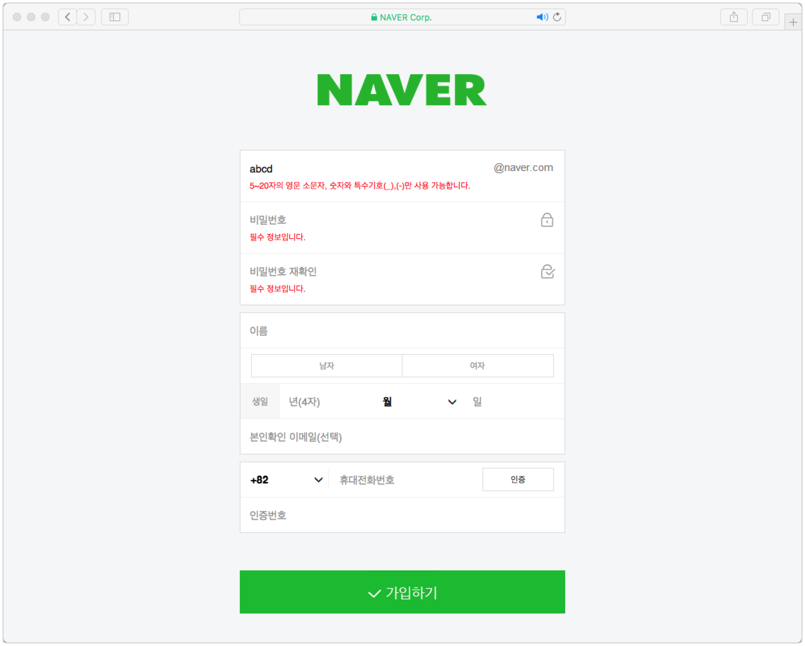

### 1-4. 연습문제

#### 문제 1

웹 사이트를 이용하면서 '와!'하고 감탄해 본 경험이 있나요? 또는 웹 사이트를 이용하면서 답답했거나 불편했던 경험이 있나요? 기억에 남는 웹 사이트의 장점은 무엇이었는지, 불편했던 웹 사이트는 어떻게 개설할 수 있는지 작성해 보세요

| 장점 | 단점 |
| :--: | :--: |
|      |      |

#### 문제 2

상품을 주문하고 무통장 입금으로 결제를 마친 이용자가 결제 방법을 카드 결제로 바꾸려고 합니다. 이런 경우, 운영자는 어떤 흐름으로 이용자에게 입금된 금액을 동려 주고, 다시 카드로 결제를 받으면 좋을지 동그라미 안에 알맞은 번호를 넣어 보세요. 상품이 배송 중인데 '당연히 다시 카드 결제를 하겠지?'라고 예상하고 환불부터 진행하면 안 되겠죠?

| 번호 |         내용          |
| :--: | :-------------------: |
|  1   | 이용자 카드 결제 진행 |
|  2   |       배송대기        |
|  3   |       배송진행        |
|  4   | 이용자에게 환불 진행  |

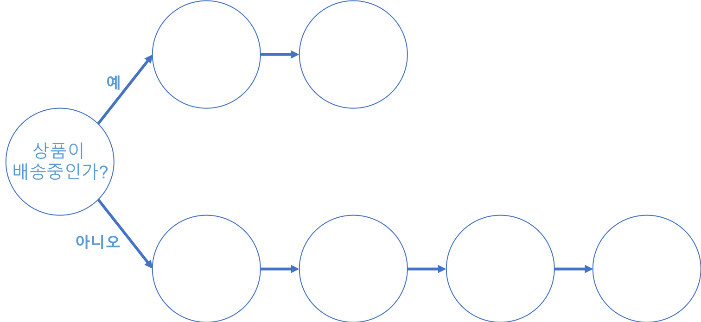

## Chapter 2. 프로젝트 진행 과정의 이해 (웹 사이트)

### 2-1. 팀의 구성

#### 디자이너

디자이너는 포토샵, 일러스트레이터 등의 디자인 프로그램을 이용하여 보여지는 화면을 디자인한다. 기획자가 제시한 화면 정의서에 따라 어울리는 메뉴, 버튼, 글꼴, 크기, 색상들을 결정하여 배치하는 작업이다. 이를 위해 클라이언트와 기획자가 조율한 내용에 따라 화면을 만드는 기술이 필요하다. 더불어 웹 사이트의 분위기, 디자인 콘셉트에 맞게 화면을 구성할 수 있는 디자인적 감각이 중요한 역할이다.

#### 퍼블리셔 (프론트엔드 개발자)

퍼블리셔는 디자이너가 작성한 화면 이미지를 HTML(Hypertext Markup Language), CSS(Cascading Style Sheets), Javascript 등과 같은 웹 프로그래밍 언어를 활용하여 웹 브라우저로 표시하는 웹 문서를 작성한다. 즉, 디자인 시안에 따라 버튼, 텍스트, 이미지 등의 사용자가 웹브라우져에서 볼 수 있는 외형적인 부분을 만드는 역할을 수행한다.

#### 개발자 (백엔드 개발자)

개발자는 웹 사이트의 내부적인 동작을 구현한다. 내부적인 동작은 웹 사이트에 표시할 정보, 이미지, 회원정보, 게시글 등을 처리하는 기능을 의미한다. 이를 위해 개발자는 PHP(PHP - Hypertext Preprocessor), ASP(Active Server Page), JSP(Java Server Page), Express.js 등의 서버 관련 프로그래밍 언어를 활용하여 서버의 동작를 구현한다. 

기본적으로 웹브라우져를 통해 사용자가 웹 문서를 조작하고 서버와 요청과 응답을 주고 받으며 작업을 처리한다. 사용자가 쇼핑몰 사이트에서 제품을 선택하면, 웹 문서에서 클릭한 제품의 코드는 서버에게 전송한다. 이후 서버는 코드를 통해 해당 제품의 정보를 데이터베이스에서 검색하여 웹 문서에 정보를 준다. 정보를 전달받은 웹 문서는 웹브라우져를 통해 제품의 상세페이지를 화면에 표시한다. 

 ### 2-2. 프로젝트 진행 과정

프로젝트의 진행과정은 크게 분석, 설계, 구현의 3단계로 나누어 볼 수 있다. 여기서는 참조 교제(Do It! 웹 사이트 기획 입문)의 웹 사이트를 제작하는 예시를 기준으로 서술하고 있다. 그러나 프로젝트의 특성에 따라 추가적인 단계가 필요한 경우가 있을 수도 있다.

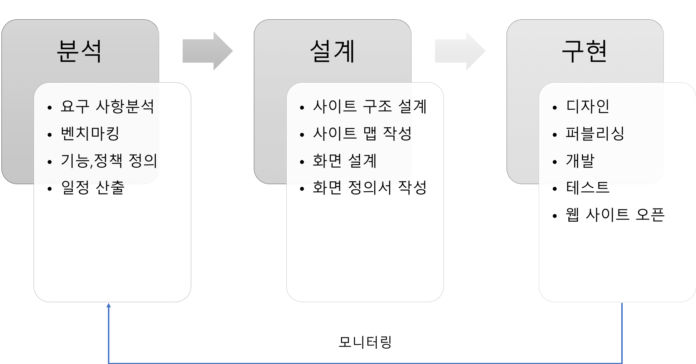

#### 분석 단계

분석단계는 클라이언트로부터 제안 요청서(RFP: Request for Proposal) 혹은 사업 계획서(이후에는 제안 요청서로 작성함)를 접수하면서 시작된다. 기획자는 클라이언트의 제안 요청서를 무조건 수용하는 것이 아니라 '**요구사항분석**'을 통해 면밀히 분석해야 한다. 따라서 제안 요청서를 토대로 추가 자료 및 기능을 검토하고, 다른 유사 웹 사이트를 **벤치마킹**하는 과정이 필수적이다. 이를 통해 제안 요청서의 내용 수행하기 위해 필요한 경비 및 기간 등을 재조정할 수 있으며, 추가적인 제안도 할 수 있다.

요구사항분석 결과를 토대로 웹 사이트의 **기능 및 정책을 정의**해야 한다. 쇼핑몰 웹 사이트를 만든다면, 상품을 목록으로 표시해야할지 격자형로 표시해하늘지 목록형으로 나타낼지 정해야 하는 것이다. 이외에도 서비스를 제공하기 위해 회원가입이 필요한가, 게시판에 글을 작성하기 위해 로그인이 필요한가 등 운영 정책들도 분명히 해야한다. 

이러한 '기능 및 정책 정의' 과정을 소홀히하면 이후의 설계 단계에서 디자이너, 퍼블리셔 및 개발자가 기존 작업 외에 추가 작업해야하는 상황이 발생할 수도 있다. 이는 경영자의 입장에서 보면 인건비의 상승, 개발 일정의 지연, 기획자에 대한 팀원들의 불신 등 부정적인 효과만 나타나므로 주의해야 한다.

웹페이지의 기능 및 정책이 정해지면 이를 바탕으로 **일정을 산출**해야 한다. 클라이언트의 제안요청서에 프로젝트를 수행할 기간이 기술되어 있으므로, 이에 맞추어 분석, 설계, 구현이 모두 완료되어야 한다. 이때 기획자는 요구사항 분석 내용, 프로젝트 참여 팀원의 수 및 역량, 다른 프로젝트 일정, 기타 변수 등을 고려하여 일정을 구성해야 한다. 

- To-do 정리

  - 요구 사항 분석하기
  - 벤치마킹하기
  - 기능과 정책 정의하기
  - 일정 산출하기

  

- 제안요청서 보기

  - 나라장터(국가종합전자포탈) : https://www.g2b.go.kr
  - 크몽 : https://kmong.com
  - 프리모아 : https://kmong.com
  - 위시켓 : https://www.wishket.com

##### 요구 사항 분석하기

요구사항분석은 클라이언트가 제공한 제안 요청서를 자세히 검토하는 단계이다. 클라이언트의 요청이 현실적으로 수용하기 어려운 경우도 있으므로, 협의를 하여 대안을 모색하는 것이다. 따라서 클라이언트의 요구사항에서 필요한 기능은 무엇인가, 전체 웹페이지 수는 몇 개인가, 어떤 디자인이 어울릴 것인가 등을 미리 구상해 봐야한다. 

| 접근 단계                                              | 설명                                                         |
| ------------------------------------------------------ | ------------------------------------------------------------ |
| 1. 실현가능한 요구사항인가?                            | 기술, 비용, 인력, 일정 등의 문제로 구현할 수 없는 기능이라면 사전에 협의하여 대안을 모색해야 한다. |
| 2. 요구한 기능과 유사한 이전 프로젝트의 기능이 있는가? | 기존에 구현해 놓은 기능을 응용 혹은 참조하면 작업시간을 줄일 수 있다. |
| 3. 클라이언트가 요구한 기능보다 더 좋은 방법은 없는가? | 클라이언트에게 역으로 제안하여 웹사이트의 완성도를 높일 수 있다. 아이디어가 창의적이면 클라이언트의 신뢰를 얻을 수 있다. |

- 요구 사항 분석 내용

|          요구사항          |  번호  | 세부내용                                                     | 의도분석                                                     | 비고 |
| :------------------------: | :----: | ------------------------------------------------------------ | :----------------------------------------------------------- | :--: |
| 내부 직원 전용 오피스 기능 | 001-01 | 내부 직원에게 업무 협업 기능 제공  1. 내부 직원이 회사 홈페이지에 가입한 후 직원 관리 - 직원의 이름, 부서, 연락처 등이 조직도 형태로 관리될 수 있어야 함.  2. 사내 메일, 사내 게시판 - 제작하는 웹 사이트와 사내 메일, 사내 게시판(일정 게시판, 회사 공지 게시판, 개인별 게시판, 작업 요청 게시판)이 연동되어 원활하게 협업할 수 있어야 함.  3. 사내 메일, 사내 게시판에 등록되는 첨부 파일은 1일에 한 번씩 백업되고, 전산 오류나 해킹 발생시 발생 시점의 1일 전으로 복구할 수 있어야 함. | 1. 일반 홈페이지의 회원가입 프로세스를 적용하되 부서별로 카테고리를 나누는 것이 좋을 것 같음  2. 필요한 기능을 확인하고 메일 시스템 솔루션을 구매할지, 새로 개발할지 결정해야 함  3.서버 자동 백업 시스템 솔류션이 필요함, 백업 공간을 하드웨어 혹은 클라우드 중에 선택해야함 |      |
| 내부 직원 전용 쇼핑몰 기능 | 001-02 | 내부 직원 복지 기능  4. 내부 직원이 사무에 필요한 용품을 결제 없이 요청 - 웹 쇼핑몰처럼 사무용품을 신청하고 구매팀에서 일괄 구매할 수 있어야 함.  5. 사내 포인트로 제품 구매 - 직원들은 회사에서 제공하는 포인트를 적립할 수 있어야 함 - 직원들은 적립된 포인트로 제품을 구매할 수 있어야 함 - 상품 카테고리는 10개 내외로 구성함. - 회사와 계약된 업체에서 업체별 관리자 화면을 제공하고, 내부 직원이 포인트로 구매한 상품을 확인할 수 있어야 함 | 4. 쇼핑몰에서 쓰는 상품 구매 기능을 응용할 것, 구매팀에서 제품 구매 시 제품이 누락되는 일이 없도록 아이디어 구체화가 필요  5. 포인트 사용 정책을 확실하게 세우고, 잘 어울리는 오픈 마켓 기능을 벤치마킹할 것 |      |

##### 벤치마킹하기

벤치마킹은 손쉽고 효과적으로 수행할 수 있는 기획방법이다. '창조적 모방'이라는 말이 있듯이 이미 서비스를 하고 있는 유사 웹 사이트에 대해 분석한다. 기존 서비스의 이용자층, 디자인, 서비스, 마케팅 등을 분석하여, 장점을 받아들이고 단점을 해소하는 접근 방식으로 서비스를 기획한다.

| 이용자층 분석                                                | 디자인, 레이아웃                                             | 서비스                                                       | 마케팅                                                       | 종합 평가                                  |
| ------------------------------------------------------------ | ------------------------------------------------------------ | ------------------------------------------------------------ | ------------------------------------------------------------ | ------------------------------------------ |
| - 조사를 통해 이용자층 분석  - 판매되는 상품과 본인, 주변 지인의 경험을 통한 이용자층 예측 | - 메인 상품 디스플레이, 메인 콘텐츠 확인  -상품촬영, 주요 콘텐츠 묘사 방법 확인 | - 구매 프로세스 분석  - 반품/교환 프로세스 분석  - 공지사항의 운영 상황을 관련 글 위주로 확인  - 고객 문의 게시판의 불만 글 위주로 확인 | - 진행중인 광고를 체크하여 홍보 비용 예상  - 진행중인 광고의 주 메시지 분석  - 회사 소개 페이지 분석  - 주 이용 고객층 분석 | - 이용자 입장에서 평가  -장단점 관리 |

분석이 완료되면 벤치마킹 보고서를 작성한다.

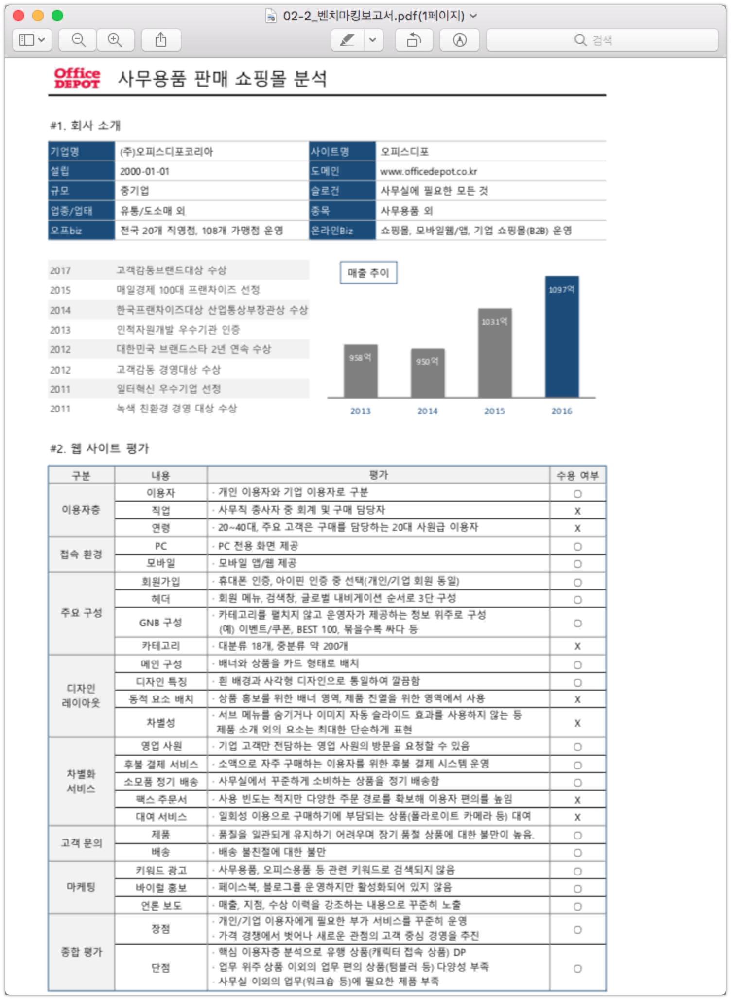

##### 기능 정의서와 정책 정의서 작성하기

기능정의서는 웹 사이트에 구현되는 기능을 작성한 문서이고, 정책 정의서는 웹 사이트를 이용하거나 운영할 때 필요한 기준(게시판 이용정책, 배송비 정책)을 모은 문서이다. 두 문서는 제안 요청서를 바탕으로 작성되어야 하며, 클라이언트와 소통을 통해 명확히 작성해야 한다.

- 기능 정의서

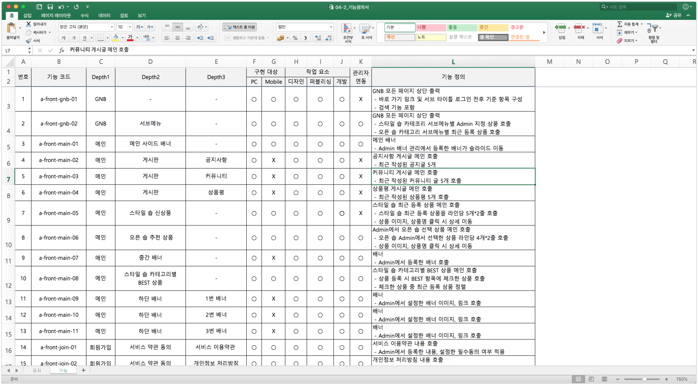

- 정책 정의서

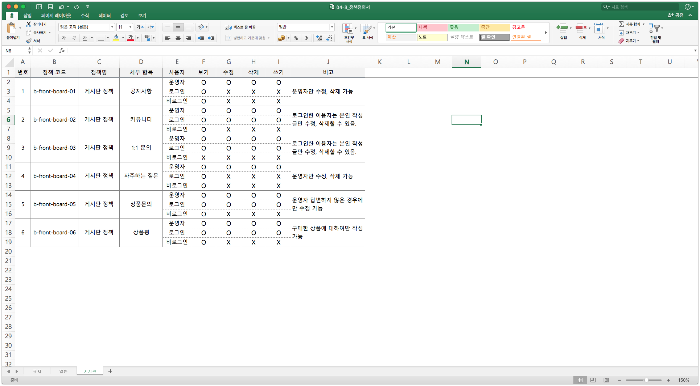

##### 일정 산출하기

기능 정의서와 정책 정의서를 통해 웹 사이트 제작의 전체 업무와 난이도를 명확히 알 수 있다. 이를 바탕으로 일정을 산출하여 정해진 기일 안에 작업을 마칠 수 있도록 계획하는 것이 일정 산출하기 단계이다. 일정은 팀원들의 작업능력, 작업 중 일어날 수 있는 변수를 고려하여 작성한다. 또한 팀원들의 의견을 수렴하여 현실적인 일정을 세워야 한다.

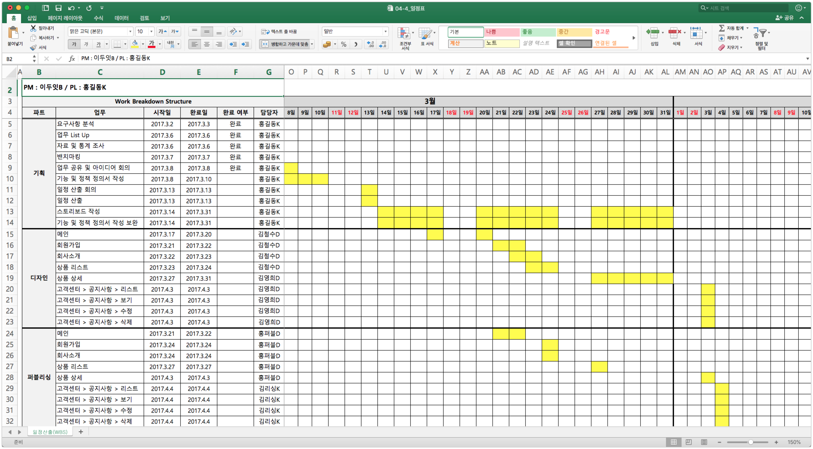

#### 설계 단계

설계는 웹 사이트의 청사진을 만드는 단계이다. 분석 단계의 내용을 바탕으로 만들어질 웹 사이트의 모습을 구상한다. 즉, 밑그림처럼 웹 페이지의 화면 구성, 디자인 콘셉트, 들어갈 텍스트, 이미지의 배치, 각 페이지의 이동, 동작 기능 등 전체를 아우르는 넓은 시점에서의 구상인 것이다. 오케스트라에서 여러 연주자들이 악보를 보고 음악을 연주하듯, 디자이너, 퍼블리셔, 개발자가  기획자의 설계를 보고 구현작업을 진행하게 된다. 따라서 설계단계가 프로젝트의 진행 및 성공 여부에 있어 매우 중요하다.

- 디자인 콘셉트를 결정할 때 고려할 요소

| 목적                                                     | 대상                                                         | 브랜드                                                       |
| -------------------------------------------------------- | ------------------------------------------------------------ | ------------------------------------------------------------ |
| 웹 사이트의 목적은 무엇인가? 예) 소개, 쇼핑, 커뮤니티 | 웹사이트의 이용자는 누구인가? 예) 20대 여성, 30대 남성 등 | 클라이언트 회사의 브랜드 키워드는 무엇인가? 예) 모던, 신뢰, 열정, 도전, 나눔 등 |

- To-do 정리

  - 사이트 구조 설계하기
  - 사이트 맵 만들기
  - 화면 정의서 작성하기

##### 사이트 구조 설계하기

사이트 구조 설계는 웹 사이트의 메뉴를 구성하는 작업이다. 기능 정의서의 내용을 토대로 비슷한 기능은 묶어서 상위와 하위 꼐념으로 만들어 메뉴를 만든다. 메뉴를 작성하면, 한눈에 전체 구조를 파악할 수 있도록 사이트 맵이 완성된다.

- 메뉴 화면

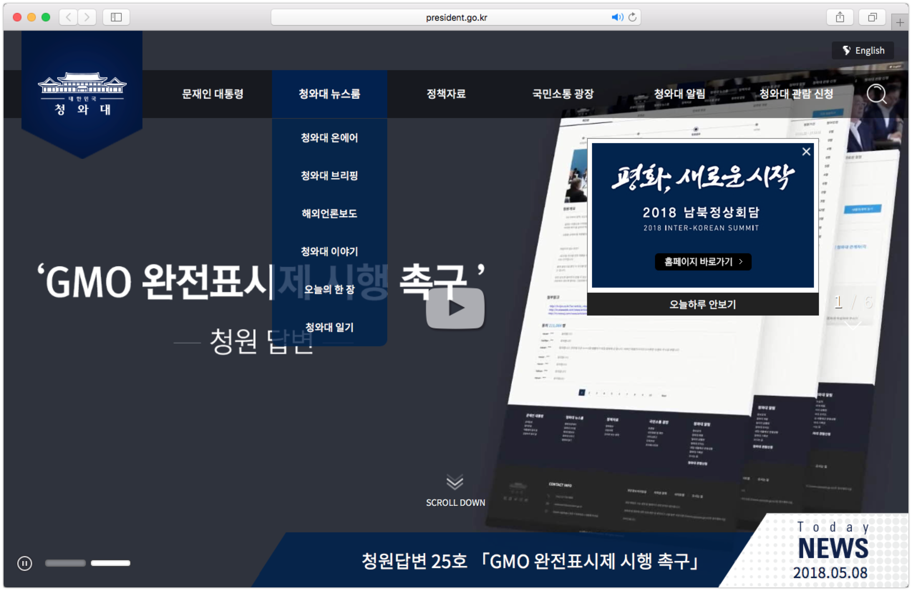

- 웹페이지 구성을 나타내는 사이트맵 (청와대 홈페이지)

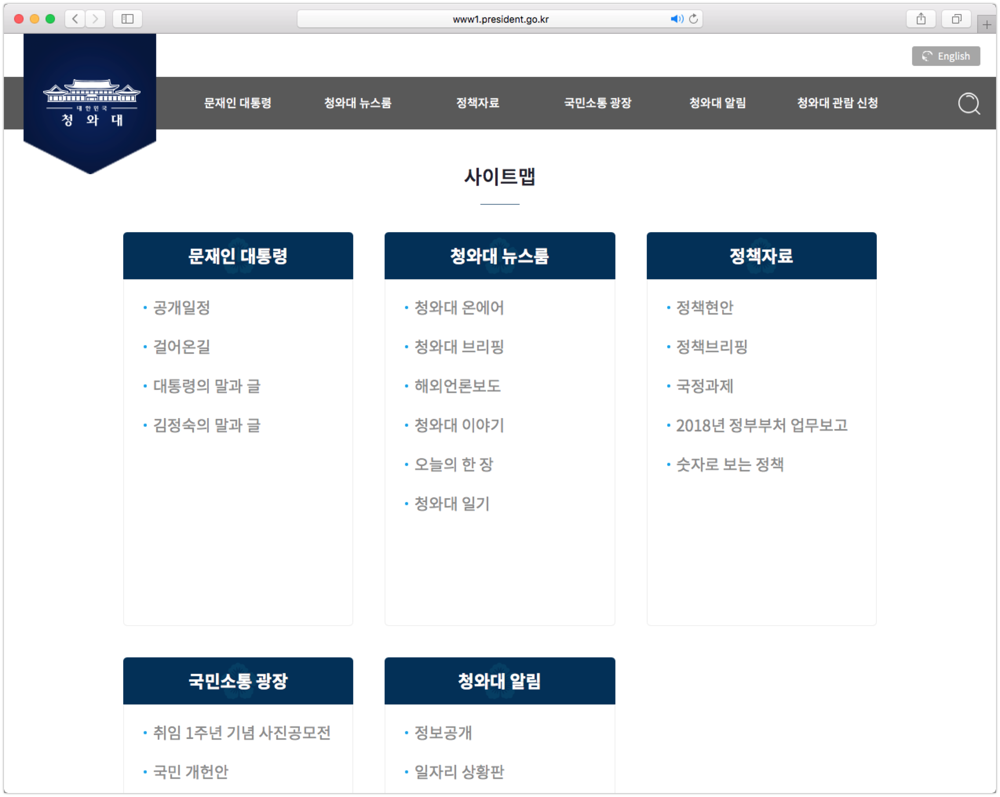

##### 화면 정의서 작성하기

화면 정의서는 실제 웹 사이트의 화면을 정의한 문서이다. 웹 사이트의 화면을 스케치하고, 특정 부분에 대해 작업자가 참조할 수 있도록 요청사항을 작성한다.

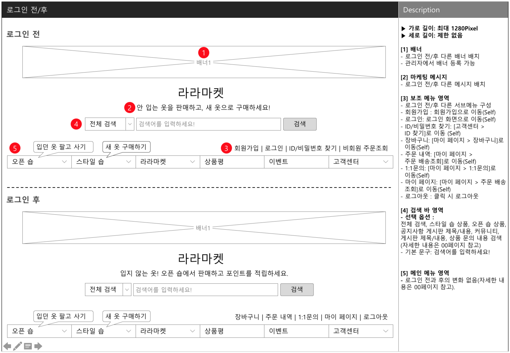

- 웹페이지 UI 구성 스캐치 (PC, Tablet, Smartphone)

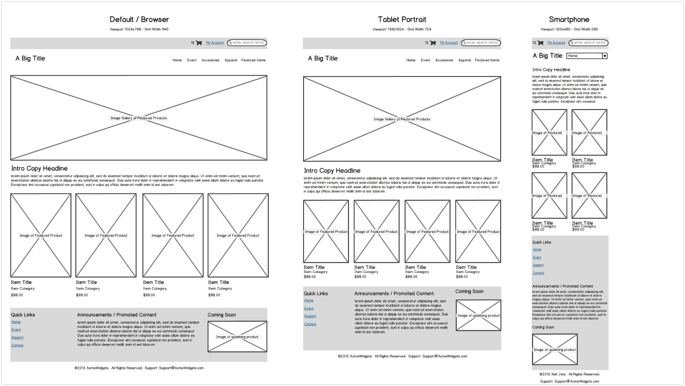 

이미지 출처 : [Basic UI/UX Design Concept Difference Between Wireframe, Prototype, and Mockup](https://www.mockplus.com/blog/post/basic-uiux-design-concept-difference-between-wireframe-prototype)

#### 구현 단계

구현 단계는 실제 웹 사이트를 만드는 과정이다. 기획자는 자신의 팀원(디자이너, 퍼블리셔, 개발자)간의 업무 진행을 조율하면서, 설계를 실체화하게 된다. 팀원들이 각 부분의 개발이 완료하면, 기획자는 체크리스트를 작성하여 결과물에서 나타나는 오류를 테스트를 한다. 이 때 발견된 오류 를 팀원을 통해 수정하고, 최종적으로는 클라이언트에게 제공할 메뉴얼을 작성하는 과정을 포함한다.

- To-do 정리
  - 디자인/퍼블리싱/개발 업무 조율하기
  - 테스트 진행 및 오류 수정하기
  - 문서화 작업하기

- 체크리스트

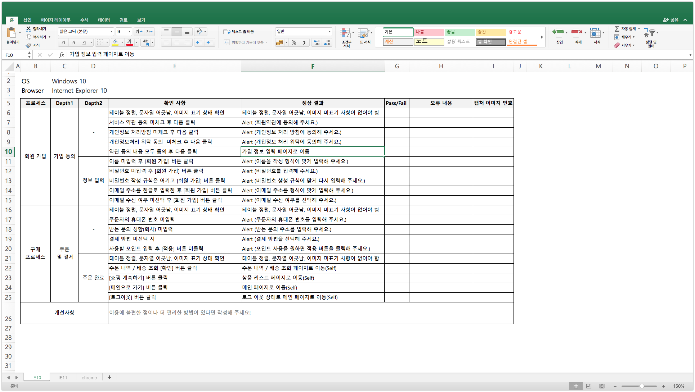

### 2-3. 웹 사이트 구동 원리와 기본 용어

####인터넷

인터넷(Internet)은 세계를 의미하는 International과 조직이나 짜임새를 나타내는 Network를 합친말이다.  일반적으로 Web 혹은 WWW(World Wide Web)과 동일한 의미로 쓰인다. 하지만 인터넷은 정보를 주고 받는 컴퓨터 네트워트를 의미하고 Web은 웹 문서를 주고 받는 서비스로 구분한다. 

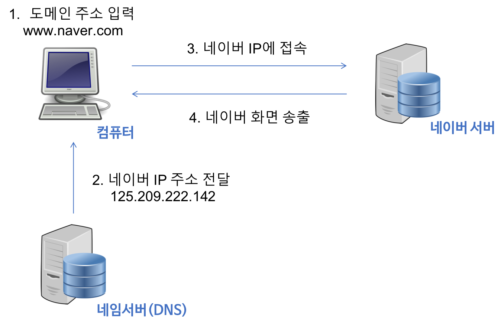

참고자료 : [고려특강 인터넷의 과거, 현재, 미래 전길남교수](https://youtu.be/lc-MT_c18nM)

#### WWW (World Wide Web) 혹은 Web

월드 와이드웹 혹은 웹은 인터넷에 연결된 컴퓨터간에 웹 문서를 주고 받을 수 있는 서비스이다. 사람들은 웹 문서에 나타난 자료와 이미지를 통해 정보를 주고 받는다. 이러한 웹 문서를 볼 수 있는 프로그램을 웹 브라우져라고 한다.

#### 서버

서버는 인터넷을 통해 다른 컴퓨터가 요청한 서비스(웹, 메일, 게임 등...)을 처리해주는 컴퓨터이다. 서버는 다른 컴퓨터에서 필요한 요청을 처리할 수 있도록 항상 전원이 켜져 있다. 서버는 여러 컴퓨터로부터 여러가지 요청을 받아 처리한다. 일반적인 컴퓨터보다 처리능력이 좋지만, 이에 비하여 비용이 많이 드는 장비이다.

안정적인 서비스를 제공하기 위해서 서버는 항상 전원이 켜져 있어야하고, 구입 비용이 많이든다. 따라서 작은 기업이나 개인이 서버를 직접 운영하기에는 전문성과 비용의 부담이 크다. 이를 해소하기위해 웹 호스팅 업체가 생겨났다. 웹 호스팅 업체는 서버를 일정 기간 동안 임대 및 관리해주는 서비스를 제공한다. 

|   서비스    | 내용                                                         |
| :---------: | ------------------------------------------------------------ |
|  웹 호스팅  | 웹 페이지를 인터넷에 연결하기 위해, 서버를 임대받는 서비스이다. 소규모 홈페이지, 인터넷 쇼핑몰을 제작할 경우 주로 활용한다. |
| 서버 호스팅 | 서버 전체를 임대받아 사용하는 서비스로, 웹서비스 이외에 메일, FTP 등 다른 서비스를 제공할 수 있다. |
| 코로케이션  | 이미 구입한 서버를 호스팅 업체에서 인터넷에 연결하고 보관, 관리해주는 서비스이다. 독립적인 서버 운영이 필요하지만, 사내에 서비 관리 인력, 거치 장소가 없는 경우에 이용한다. |

- 참고 웹페이지
  - 가비아 : https://www.gabia.com
  - 아마존 AWS : https://aws.amazon.com

#### 도메인

도메인은 웹 페이지로 접속하기 위해 필요한 문자열로 된 주소이다. 인터넷에 연결된 컴퓨터는 각자 IP(Internet Protocal) 주소라는 숫자형태의 주소(예시 : 125.209.222.142)를 부여받는다. 하지만 이용자들이 IP주소를 기역하기 어려운 점이 있어, 웹페이지를 표현할 수 있는 문자형태로 주소(예시 : www.naver.com)를 쓰게 되었다.

#### 네임서버 (DNS server: Domain Name System server)

네임서버는 사용자가 웹 브라우저의 주소창에 입력한 도메인을 IP주소로 교환해주는 역할을 하는 서버이다. 이용자들의 편의성을 위해서는 문자열 형태의 주소를 활용하였지만, 인터넷에서는 서버를 찾아가기 위해 IP주소를 활용해야 한다. 따라서 도메인을 IP주소로 변역해주는 통역가의 역할을 하는 것이 네임서버이다.

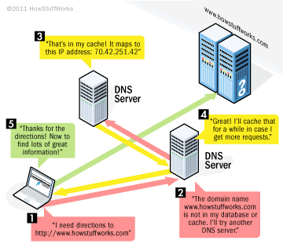

- 그림 내용 해설

  1. PC :  "http://www.howstuffworks.com" 웹페이지로 이동하고 싶다.

  2. DNS server (네임서버) : 나의 데이터베이스에는 "http://www.howstuffworks.com"의 정보가 없어, 다른 네임서버에 물어볼게.

  3. 다른 DNS server (네임서버) : 내가 그 사이트 주소가지고 있어 IP주소는 "70.42.251.42"야.

  4. DNS server (네임서버) : 좋아, 그 IP 주소 저장해 놓을게, PC야 이 주소로 이동해

  5. PC : 고마워, 이제 웹페이지에 접속해볼까!

     

#### FTP

FTP(File Transfer Protocal)이란 인터넷을 통해 파일을 주고받을 수 있는 통신 규칙이다. 약속된 통신 규칙이 없다면, 서로 다른 컴퓨터가 파일을 주고받는 일을 수행할 수 없으므로 미리 정해높은 절차가 필요하다. 이를 통신 규칙 혹은 통신 규약 영어로는 프로토콜(Protocal)이라 표현한다. 주로, 서버에 파일(웹문서, 그림, 동영상, 기타)등의 파일을 업로드하거나 다운로드 할 때 활용된다.

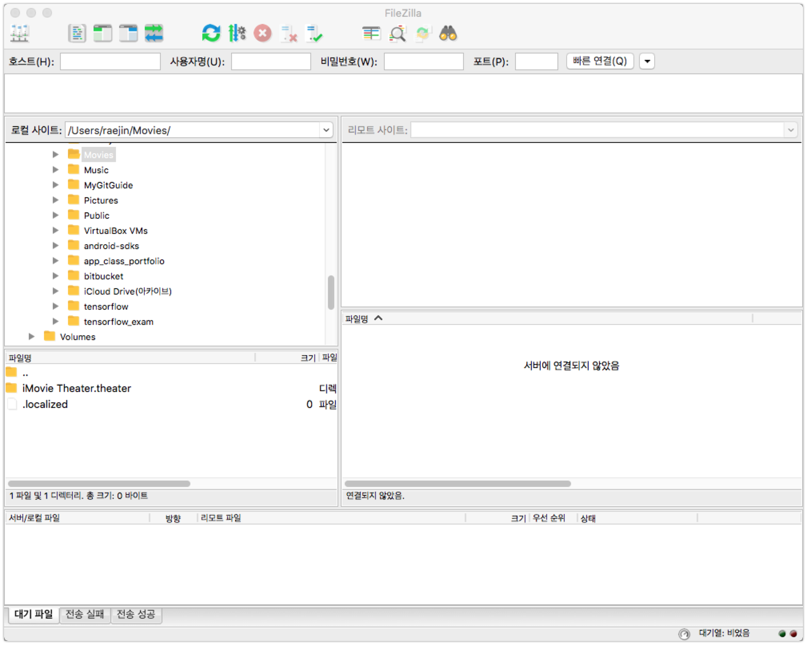

####HTTP

HTTP는 웹 문서를 주고 받는 서비스인 www에서 정보를 어떻게 주고 받을지 정해높은 통신규칙이다. 주로 웹 문서를 주고 받는데 쓰인다.

#### URL

URL (Uniform Resource Locator)는 서버에 저장된 자료의 위치(경로)를 표현하는 방식이다. 일반적으로 인터넷 주소로 부른다. 하지만 정확히는 서버에 저장된 자료들의 주소를 의미하는 것으로 파일이름, 소속된 폴더 이름으로 표현되어 있다.

### 2-4. 연습문제

#### 문제1

다음은 일반적인 웹 사이트 제작 과정입니다. 웹 기획자의 역할을 단계별로 작성해 보세요.

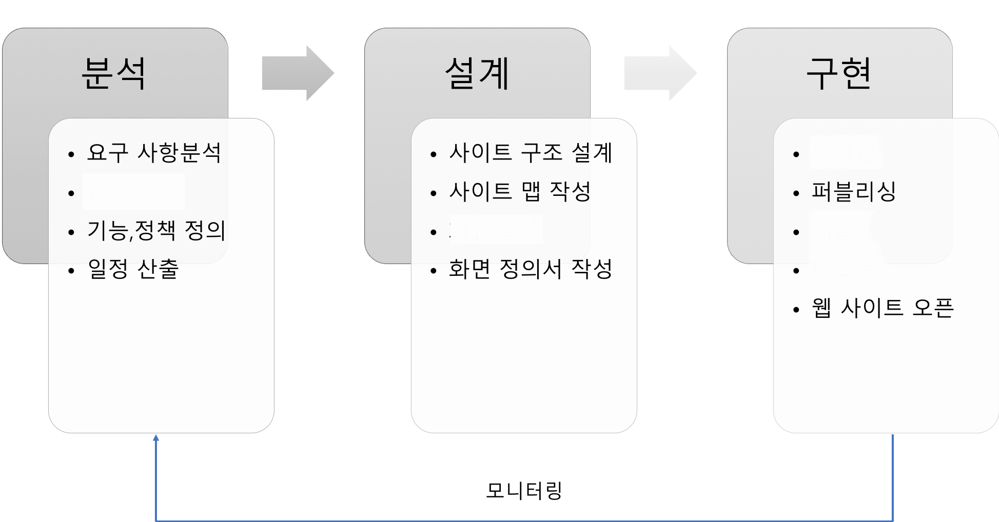

#### 문제2

이지스 퍼블리싱 웹 사이트(www.easyspub.co.kr)의 메인 화면에 Do It 시리즈 상품 5개, 된다 시리즈 상품 5개, DCM 프로 사진가 상품 5개를 진열하려고 합니다. 이지스 퍼블리싱 웹 사이트에서 제공하는 책의 소개 항목을 기준으로 아래와 같이 진열할 수 있는지 생하고, 그 이유를 생각해 보세요

| 진열방법                                                     | 진열 여부 | 이유 |
| ------------------------------------------------------------ | :-------: | :--: |
| 각 카테고리별 가격이 높은 책 5권을 진열할 수 있다.           |           |      |
| 각 카테고리별 최근 발행된 책 5권을 진열할 수 있다.           |           |      |
| 각 카테고리별 표지에 파란색이 들어간 책 5권을 진열할 수 있다. |           |      |
| 각 카테고리별 개정판 책 5권을 진열할 수 있다.                |           |      |
| 각 카테고리별 많이 판매된 책 5권을 진열할 수 있다.           |           |      |

