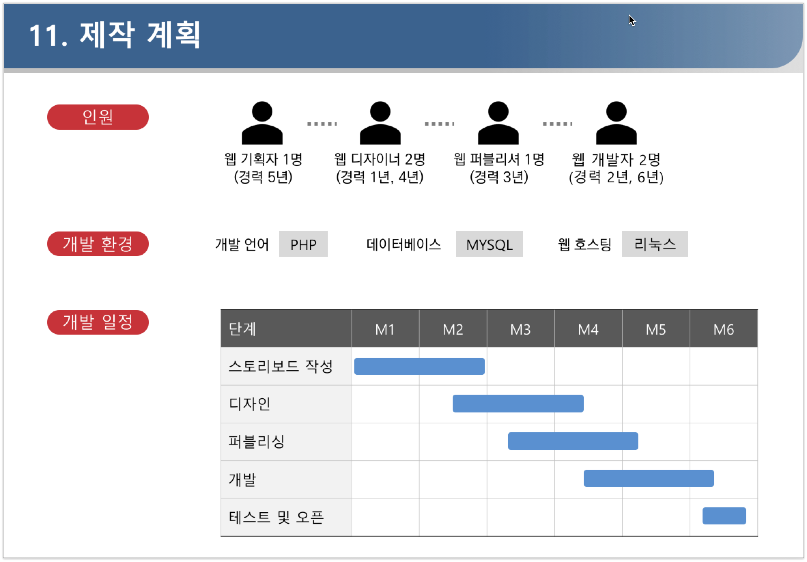

# UI/UX 기획 입문 해설 Chapter 3

**작성자** : 정래진 (jrj8819@naver.com)

**작성일** : 2018.05.14

**참조**

- 이정원, *Do it! 웹 사이트 기획 입문*, 이지스 퍼블리싱, 2018

## Chapter 3. 웹 사이트 기획하기

이제 기획이 무엇인가 실습해보자. 이 글에서는 교재('Do it! 웹 사이트 기획 입문')에서 소개한 '라라마켓(LaLa Market)'이라는 가상의 여성의류 쇼핑몰의 기획과정에 대해 소개한다. 

### 3-1. 사업계획서 살펴보기

회사에서 프로젝트 기획을 진행하게 되면, 클라이언트에게 사업계획서를 전달받는다. 기획자로써 우선적으로 해야할 일은 사업계획서를 이해하는 일이다. 클라이언트는 웹 사이트를 통해서 무엇을 하고 싶은 것인지를 정확히 알고 있어야 그에 맞는 대응을 할 수 있기 때문이다. 다음은 교재의 사업계획서를 발췌한 내용이다.

#### 사업의 필요성

의류 웹 쇼핑몰 시장은 이미 많은 업체가 뛰어들었고, 그만큼 경쟁이 치열합니다. 이와 같은 시장에서는 다른 업체보다 더 많이 노출하기 위해 마케팅에 의존하려는 경향이 강합니다. 하지만 마케팅은 곧 돈입니다. 따라서 자본이 부족한 신생 쇼핑몰은 마케팅보다는 사업 자체에서 차별점을 만드는 전략이 필요합니다.

새 옷을 구매하는 속도가 점점 빨라지고 있습니다. 패스트 패션의 영향으로 적은 비용으로 얼마든지 최신 유행하는 옷을 구매할 수 있게 되었습니다. 유행을 쫓고 싶은 욕구를 포기 할 순 없지만, 옷장은 점점 입지 않는 옷으로 가득찹니다. 유행이 지났다는 이유로 1~2회 입은 멀쩡한 옷을 쉽게 버리기도 합니다. 하지만 내가 입지 않은 옷이 누군가에게는 필요한 옷이 될 수 있지 않을까요?

- 분석 참고 사이트

  삼성경제연구소 :www.seri.org

  LG경제연구원 : www.lgeri.com

  국회도서관 : www.nanet.go.kr

  통계청 : www.kostat.go.kr

  특허청 : www.kipo.go.kr

#### 웹 쇼핑몰 소개

라라마켓은 이 점에 착안하여 기획했습니다. 한 쇼핑몰 안에 2개의 숍을 운영하는 것이 특징입니다. 오픈 숍(Open Shop)은 이용자끼리 상품을 거래할 수 있는 숍이고, 스타일 숍(Style Shop)은 일반적인 상품 구매 숍입니다. 이용자는 자신의 상품을 오픈 숍에서 판매하면 포인트를 얻는데, 이 포인트로 스타일 숍에서 상품을 저렵하게 구매할 수 있습니다. 2개의 숍이 상품의 선순환을 이끌며 긴밀하게 연결되어 있기 때문에 이용자는 라라마켓에서 세련된 스타일과 알뜰한 소비를 한 번에 해결할 수 있습니다. 이로써 웹 쇼핑몰 제작에 대한 목적이 확실하게 생겼습니다.

#### 경쟁사 분석 및 쇼핑몰 제작 계획

경쟁사를 찾아보니 아직까지는 유사한 업종은 없는 것 같습니다. 그럼 상품의 구매와 판매를 모두 할 수 있는 웹 쇼핑몰을 마음 놓고 만들어 볼 수 있겠습니다. 다만, 이용자끼리 상품을 거래하기 때문에 구매자와 판매자 간의 문제가 발생하지 안도록 개인정보보호와 상품 유통 부분에서 높은 수준의 서비스를 제공해야 합니다.

마지막으로 디자인 방향을, 마케팅 계획, 제작 인원, 개발 환경, 개발 일정까지 쇼핑몰 제작 계획을 구체화합니다. 사업 계획서를 살펴보니 일반적인 웹 쇼핑몰과 비교할 때 가장 큰 특징은 이용자가 직접 상품을 등록해서 판매하거나 다른 이용자가 등록한 상품을 구매할 수 있는 기능(오픈 숍)을 기획해야 한다는 점입니다. 구조는 일반적인 웹 쇼핑몰보다 복잡하지만, 조금만 응용하면 새로운 개념의 웹 쇼핑몰을 기획할 수 있습니다.

### 3-2. 연습문제1

다음의 그림과 같이 자신이 만들고자 하는 웹 사이트에 대해 정의해보자. 주제는 자유롭게 선정해도 좋으며, 웹 사이트가 아닌 스마트폰 애플리케이션으로 작성하여도 좋다. 결과물은 파워포인트 프로그램 혹은 노트를 활용하여 정리하자.

### 3-3. 기능 정의서 작성하기

사업계획서에서 제작할 웹 사이트의 특징과 필요한 기능들을 살펴볼 수 있었다. 하지만 작업을 하기 위해서는 더 정확하게 기능이 정의되어야 한다. 기능 정의서는 웹 사이트 화면에 포함되는 기능을 정리해 놓은 문서이다. 디자이너, 퍼블리셔, 개발자는 기능 정의서를  보고 자신이 작업할 부분을 파악하게 된다. 따라서 기획자는 기능에 대해 빠짐없이 명확하게 정의를 해주는 것이 중요하다.

GNB는 웹 페이지 상단의 메뉴바를 의미한다.

#### (1) 기능코드

기능코드는 기능마다 부여되는 고유한 코드이다. 기능 정의서에 작성된 기능들에게 고유한 이름을 붇여줌으로써 작업자들간에 의사소통을 원활하게 할 수 있다. 예시로 특정 기능에 'a-front-main-01'이라는 코드가 붙여졌다면, 기능정의서에서 코드를 찾아서 상세한 기능 정의 내용을 확인하며 작업을 진행한다. 

코드는 일정한 규칙으로 작성해야 한다. 이는 코드의 내용으로 어느 부분의 기능인지 확인할 수 있는 장점이 있기 때문이다. 규칙은 회사, 프로젝트의 크기 등에 따라 다르게 적용될 수 있다. 다음은 코드명 작성 규칙에 대한 예시이다.

|      | 내용                                                         |
| ---- | ------------------------------------------------------------ |
| 규칙 | 프로젝트 이름(혹은 프로젝트 이름 이니셜)-화면정의(이용자:front, 관리자:back)-메뉴이름-번호  - 프로젝트 이름은 프로젝트 이름 이니셜을 활용할 수 있다. - 화면정의는 이용자 페이지인 경우는 front, 관리자 페이지인 경우는 back |
| 예시 | A-front-join-01                                              |
| 해석 | A라는 프로젝트의 이용자 화면에서 회원 가입 메뉴 첫번째 기능  |

#### (2) 뎁스

기능정의서에서 뎁스(Depth)는 웹페이지 화면 내 기능을 구분지어주는 범주이다. 사전적인 의미로 뎁스는 '깊이'를 의미한다. 이러한 이름이 붙여진 이유는 기능을 품고 있는 웹페이지 화면이 계층적으로 구성되기 때문이다. 아래의 내용처럼 뎁스가 구성되어 있다고 하자.

| Depth1 | Depth2 |  Depth3  |
| :----: | :----: | :------: |
|  메인  | 게시판 | 공지사항 |

웹페이지의 메인페이지(Depth1) 화면에서 '게시판'(Depth2)을 선택한다. 화면상에 나타난 게시판 페이지에서 '공지사항'(Depth3)으로 이동하면 나타나는 화면에 포함되는 기능인 것이다.

#### (3) 구현 대상, 작업 요소, 관리자 연동

구현 대상은 웹 사이트가 표시될 환경에 대한 정의이다. 예시에서는 PC, Mobile 등으로 구분하였지만 프로젝트의 특성에 따라 다양하게 추가할 수 있다. 작업요소는 필요한 작업과정을 표시한 것이다. '디자인', '퍼블리싱', '개발'로 구분되어 있으며, 기능을 구현하기 위해 필요한 작업등을 체크한다. 예를 들어 단순히 디자인 작업만 수행하면 된다면 다음과 같이 작업요소를 구분할 수 있다. 이를 통해 해당 기능을 구현하기 위해 누구와 협업해야 하는지 알 수 있고, 테스트를 준비할 때도 편리하다.

| 디자인 | 퍼블리싱 | 개발 |
| :----: | :------: | :--: |
|   O    |    X     |  X   |

관리자 연동은 사용자 페이지가 관리자 페이지에서 정보를 받아 동작하는 경우에 표시한다. 관리자 페이지는 사용자 페이지에 표시할 상품을 등록하거나 관리자 계정으로 작업을 처리하기 위한 페이지이다. 따라서 관리자 페이지에 작업한 내용이 사용자 페이지에 적용되는 기능을 체크하여 연동이 잘 이루어지는지 확인할 필요가 있다.

#### (4) 기능 정의

기능 정의는 해당 기능에 대한 설명을 작성하는 부분이다. 일반적인 기능(로그인, 로그아웃, 게시판 글작성)등은 간략하게 작성해도   기능을 이해하는데 무리가 없다. 하지만 새로운 기능에 대해서는 가능한 자세하고 정확하게 작성해주는 것이 개발 작업시 혼란을 방지할 수 있다. 다음은 새로운 기능을 '기능역할', '이용방법', '개발요소' 등으로 나누서 작성한 예시이다. 3가지를 모두 작성할 필요는 없지만 가능하면 작업자가 이해하기 쉽도록 서술하는 것이 중요하다.

| 기능 역할                                                    | 이용방법                                                   | 개발요소                                                     |
| ------------------------------------------------------------ | ---------------------------------------------------------- | ------------------------------------------------------------ |
| - 제품 금액을 결제합니다. - 결제 방법 : 신용카드, 계좌이체, 무통장입금 | - [결제 방법]선택, 이용자가 선택한 방법에 따라 결제됩니다. | - 결제 방법, 가격정보 결제 모듈에 전송한 후 결제 성공 여부 확인 >> 결제 성공 시 결제 완료 페이지로 이동 >> 결제 실패 시 실패 사유 노출 후 결제 정보 입력 단계로 이동 |

### 3-4. 연습문제2

연습문제1에서 작성한 웹페이지 정의를 활용하여 기능 정의서를 작성해보자. 기능 정의서를 제대로 작성하려면, 전체 작업을 이해하고, 밑그림을 그릴 수 있어야 한다. 즉, 경험이 필요한 것이다. 다만, 처음 기획을 해보는 입장에서 뎁스, 작업 요소을 정하기 쉽지 않다. 우선 뎁스와 작업요소가 작성하기 어렵다면, 생략하고 다른 항목에 집중하여 작성하자. 필요한 기능이 잘 생각나지 않는다면, 비슷한 사이트를 찾아서 밴치마킹해보자.

기능 정의서 양식 다운로드 링크 : https://drive.google.com/file/d/1HOLdClZpYFOqvBAXL1zNOfKTC_Z0IVcV/view?usp=sharing

### 3-5. 정책 정의서 작성하기

정책 정의서는 서비스를 운영하기 위해 필요한 규칙을 정리한 문서이다. 댓글을 작성할 때, 로그인을 해야한다거나, 쇼핑몰에서 쿠폰을 받으려면 회원가입을 해야했던 것 경험이 있을 것이다. 이 밖에도 웹페이지의 종류에 따라 회원 관리, 교환/환불, 상품 구매 정책들이 있을 수 있다. 세대외 사회가 성장해 나감에 따라 법도 개정되는 것처럼 정책 정의서의 정책도 정기적으로 검토와 업데이트를 해주어야 한다. 하지만 기본적인 정책에 한하여는 개발이 진행되기 전에 정리해야 한다. 개발 도중 정책이 수정된다면 작업자간에 혼선이 올 수 있으며, 관련된 다른 작업 일정에 지연일 발생할 수 있다.

예를 들면 비밀번호의 입력 제한을 다음과 같이 수정한다고 하자.

| 수정 전                                              | 수정 후                                                      |
| ---------------------------------------------------- | ------------------------------------------------------------ |
| 비밀번호는 숫자, 소문자를 포함한 8글자까지 가능하다. | 비밀번호는 숫자, 소문자, 특수문자(!@#$%)을 포함한 10글자까지 가능하다. |

비밀번호 입력 제한이 수정되면, 회원가입에서 비밀번호를 검사하는 기능에 특수문자를 허용해야 한다. 회원정보도 글자수를 8개에서 10개 까지 저장할 수 있도록 수정해야 한다. 이처럼 정책이 바뀌면 관련된 기능에 대해서 모두 수정 작업을 해야하므로, 정책정의서를 작성할 때는 신중하게 검토해야 한다.

| 정책                | 예시                                                         |
| ------------------- | ------------------------------------------------------------ |
| 포인트정책          | 세금, 결제 수수료, 제품 판매 수익금을 고려하여 적립 포인트를 결정한다. 예시) 구매 포인트 적립 : 1만원 이상 구매 고객에게 1% 적립 |
| 배송정책            | 제품 다량 구메, 제품의 부피, 판매 수익금을 고려하여 배송비를 결정하고, 무료 배송의 기준을 결정한다. 예시) 배송료 : 1만원 이하는 2500원, 1만원 초과는 무료배송 |
| 교환/반품/환불 정책 | 교환, 반품 가능 여부를 미리 이용자에게 안내해야 하므로 기준일을 정한다. 교환, 반품 가능 기간 : 배송 완료일 기준 7일 이내 |
| 게시판 정책         | 게시판의 성격을 고려한 접근 권한 및 웹 사이트 운영을 저해하는 글에 대한 처리방안을 결정한다. 예시) 공지사항 글쓰기 권한 : 이용자 작성불가, 관리자만 작성가능 |
| 고객 관리 정책      | 블랙리스트 관리 여부, 우수 고객 기준과 우수 고객 관리에 필요한 정책을 결정한다. 예시) 우수 고객 : 월 100만원 이상 구매 고객에게 3만 포인트 증정블랙리스트 관리 여부, 우수 고객 기준과 우수 고객 관리에 필요한 정책을 결정한다. 예시) 우수 고객 : 월 100만원 이상 구매 고객에게 3만 포인트 증정 |

#### 정책정의서의 내용

(1) 정책코드 : 정책에 대한 고유한 코드이다. 기능코드와 마찬가지로 일정한 규칙으로 코드를 정해준다.

코드는 일정한 규칙으로 작성해야 한다. 이는 코드의 내용으로 어느 부분의 기능인지 확인할 수 있는 장점이 있기 때문이다. 규칙은 회사, 프로젝트의 크기 등에 따라 다르게 적용될 수 있다. 다음은 코드명 작성 규칙에 대한 예시이다.

|      | 내용                                                         |
| ---- | ------------------------------------------------------------ |
| 규칙 | 프로젝트 이름(혹은 프로젝트 이름 이니셜)-화면정의(이용자:front, 관리자:back)-메뉴이름-번호  - 프로젝트 이름은 프로젝트 이름 이니셜을 활용할 수 있다. - 화면정의는 이용자 페이지인 경우는 front, 관리자 페이지인 경우는 back |
| 예시 | A-front-join-01                                              |
| 해석 | A라는 프로젝트의 이용자 화면에서 회원 가입 메뉴 첫번째 기능  |

(2) 정책명 : 정책을 구분할 수 있는 카테고리이다.

(3) 세부항목 : 해당 정책의 하위단계이다. 정책의 수가 작을 때는 세부항목을 생략할 수 있다.

(4) 소개 : 정책 결정이 필요한 사항을 입력한다.

(5) 정책 정의 : '소개'에 입력한 사항에 대해 자세한 정책을 정의한다.

게시판에 대해서는 사용자와 기능에 따라 사용권한을 각각 정의해야 하기 때문에 추가적인 양식을 활용하기도 한다.

(6) 사용자 : 게시판을 이용하는 사용자에 따라 구분한다.

(7) 사용권한 : 게시판에서 해당 사용자가 해당 동작을 수행할 수 있는 권한이 있는지 표시한다.

### 3-6. 연습문제3

정책 정의서를 작성해보자. 각자 생각하고 있는 웹 사이트를 기준으로 필요한 정책을 기록하자.  사이트에 게시판이 있다면, 사용자와 사용권한에 대해서도 작성하도록 하자. 유사한 웹 사이트를 참고해도 좋다. 

정책 정의서 양식 다운로드 링크 : https://drive.google.com/file/d/1HOLdClZpYFOqvBAXL1zNOfKTC_Z0IVcV/view?usp=sharing

### 3-7. 일정표 만들기

일정표는 세부일정을 조율하기 위해 작성한다. 일정을 시각적인 표로 표시하면, 작업의 진행 상황을 쉽게 확인 할 수 있다. 주어진 기간은 제한적이고 클라이언트가 추가적인 내용을 제시할 수도 있으므로, 가능한 일정을 단축하는 것이 중요하다. 하지만 작업을 수행하면, 일정 진행을 지연시키는 여러 일들이 발생하기 마련이므로 일정표는 작업자와 소통을 통하여 현실적으로 작성해야 한다.

#### 일정표 작성하기

(1) 파트 : 웹 사이트의 제작 순서에 따라 업무 파트를 구분한다. 일반적으로 기획, 디자인, 퍼블리싱, 개발, 테스트, 수정으로 분류되며 프로젝트의 특성상 추가될 수 있다.

(2) 업무 : 각 파트에서 진행해야 하는 업무를 나열한다. 업무를 세분화하여 작성하면 일정을 더욱 정확하게 산출할 수 있다.

(3) 시작일, 종료일 : 업무의 시작일과 완료일을 작성한다.

(4) 완료 여부 : 업무가 끝나면 '완료' 표시를 한다.

(5) 담당자 : 같은 파트여도 담당자가 여러명일 수 있으므로, 업무 단위별로 담당자를 표기한다. 담당자 항목을 통해서 어느 직원에게 작업이 집중되어 있는지 확인할 수 있게 된다. 이때는 작업을 다른 직원에게 분산하여 진행하는 유연성이 필요하다.

(6) 일정 : 계획한 업무 기한만큼 표시한다. 기본적으로 예측한 업무 기한을 표기하지만 업무를 진행하면서 실제 업무를 진행한 기한을 같이 표기하기도 한다.

### 3-8. 연습문제4

일정표를 작성하여 보자. 이 수업에서는 개발은 진행하지 않으므로 기획 부분만 표시하자. 업무 부분은 위 그림에 있는 내용을 활용하여도 좋으며, 각자 필요하다고 생각되는 부분을 추가하여도 좋다. 이후 포트폴리오 작업을 진행하면서 실제로 수행한 일정도 같이 입력할 수 있도록 일정표를 만들자.

일정표 양식 다운로드 링크 : https://drive.google.com/file/d/1HOLdClZpYFOqvBAXL1zNOfKTC_Z0IVcV/view?usp=sharing