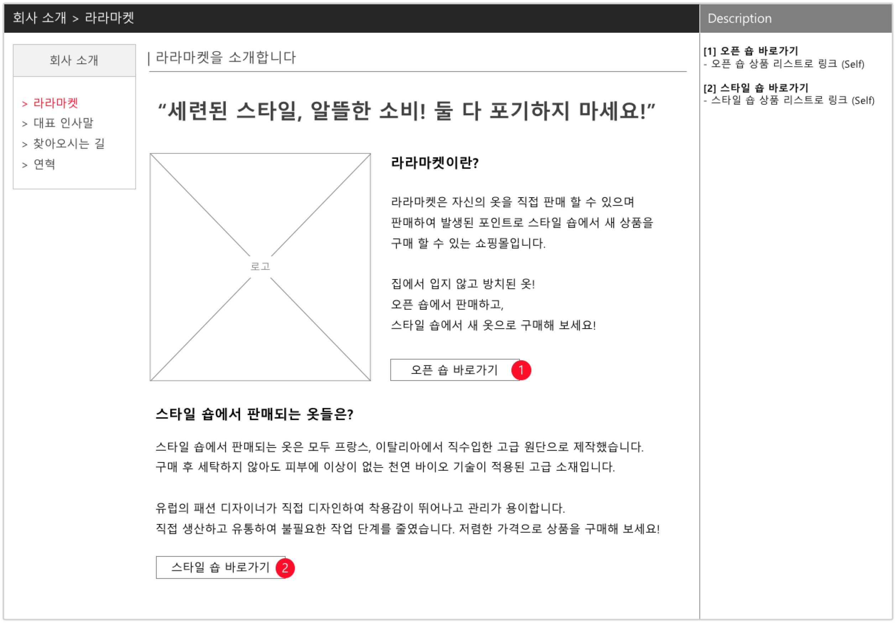
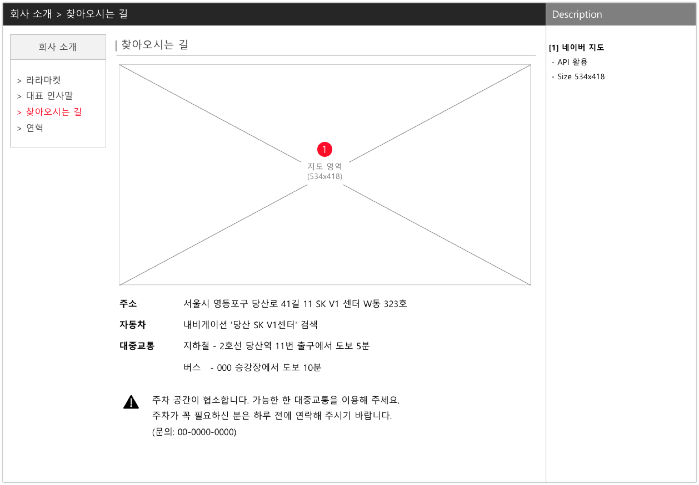
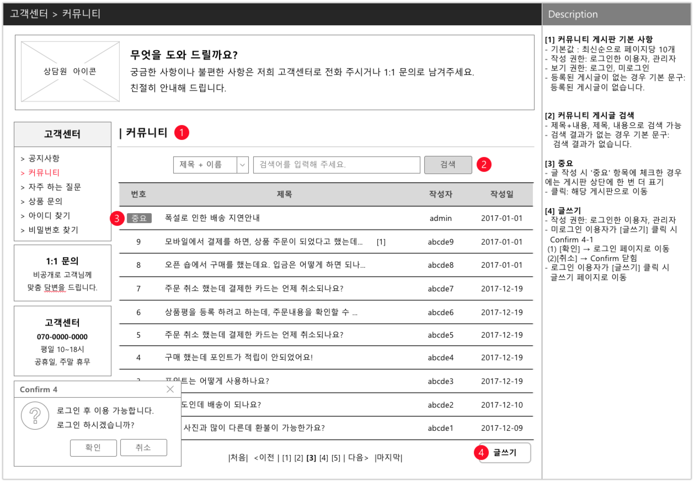
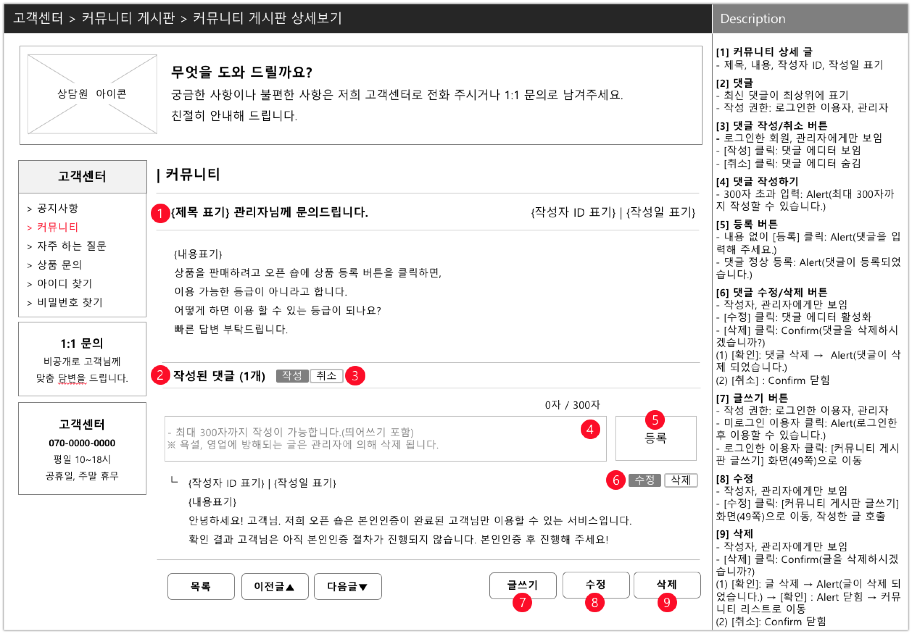
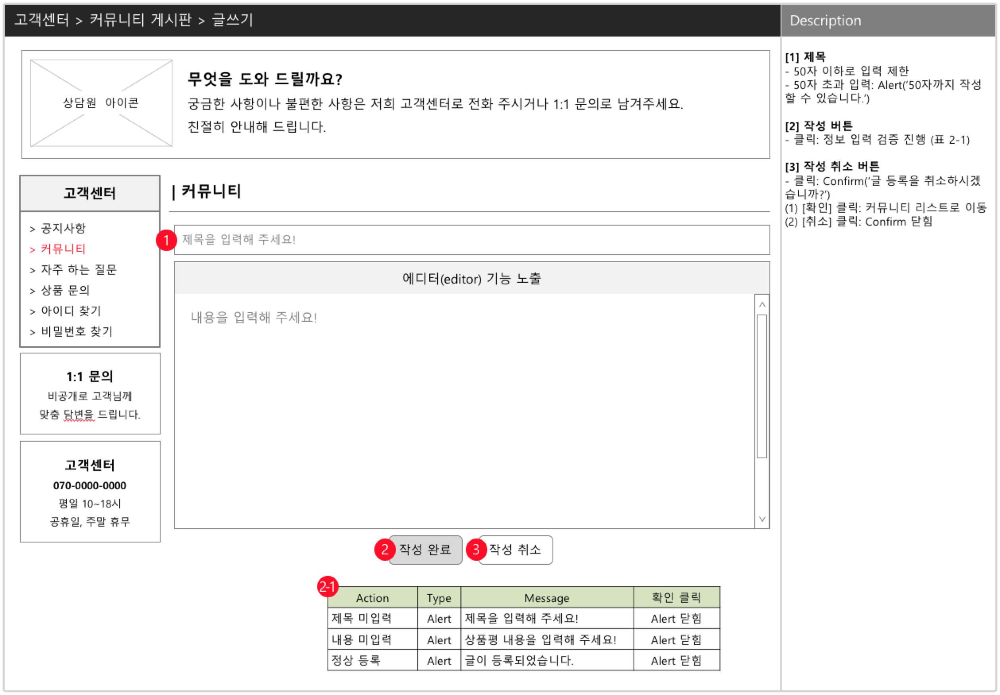
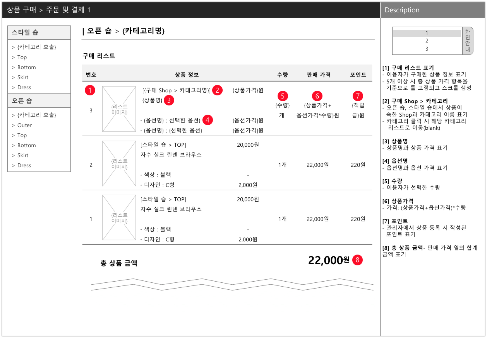
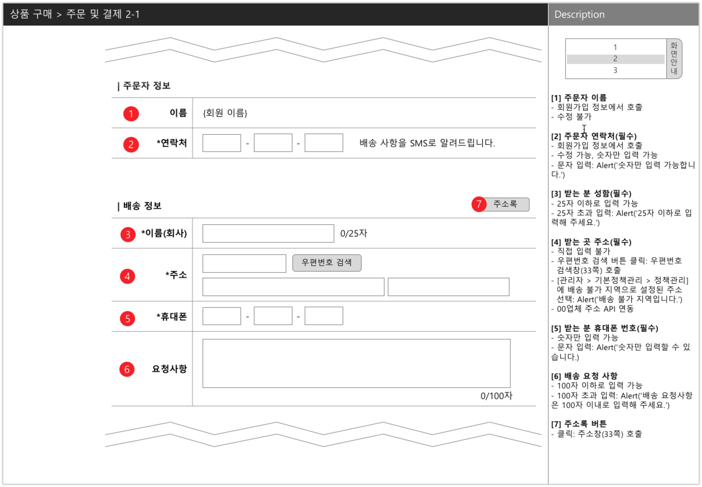
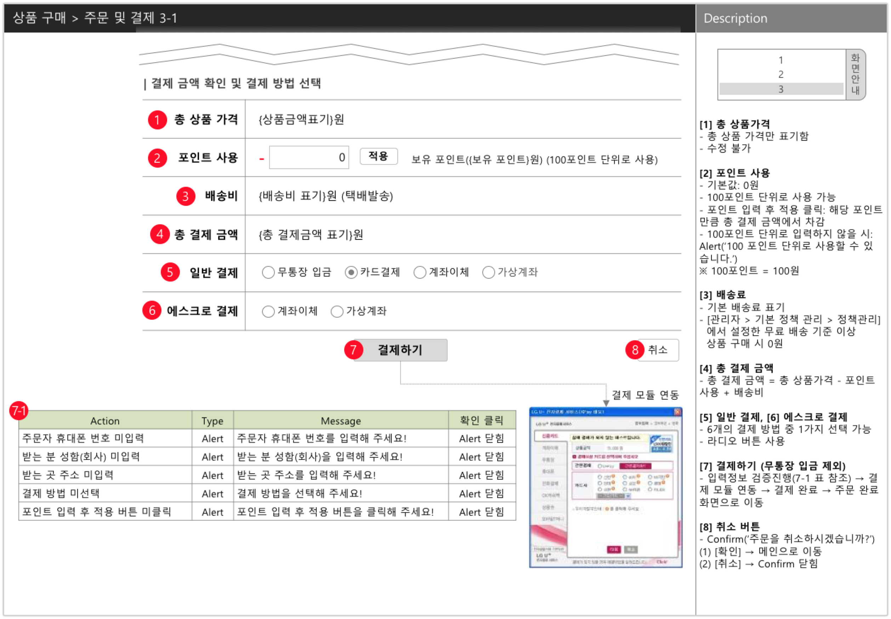
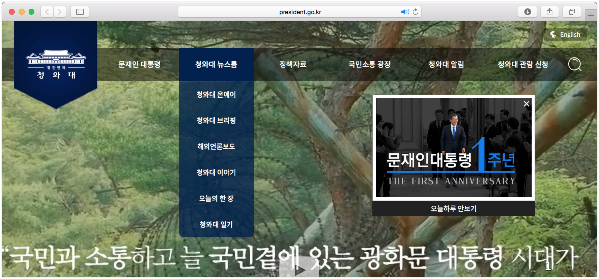
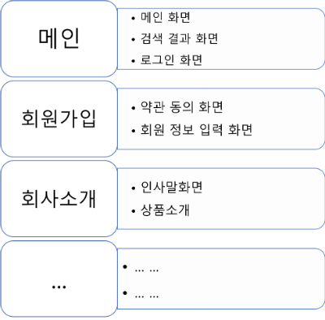

# UI/UX 기획 입문 해설 Chapter 4

**작성자** : 정래진 (jrj8819@naver.com)

**작성일** : 2018.05.14

**참조**

- 이정원, *Do it! 웹 사이트 기획 입문*, 이지스 퍼블리싱, 2018

## Chapter 4. 웹 사이트 화면 설계하기

### 4-1. 기능을 화면으로 바꾸기

앞에서 정의한 기능을 화면으로 구성해야 한다. 이를 위해서 기능의 범위, 표현 방식, 기획자의 의도에 따라 화면을 만들 수 있다. 하나의 기능을 세분화하여 여러 화면으로 구성할 수 있고, 반대로 여러 기능을 한 화면안에 적용할 수 있다. 기획자는 사용자의 편의성, 기획 목적에 따라 사용할 화면의 수를 결정해야 한다.

#### 하나의 기능을 하나의 화면으로 설계한 경우

기능을 정확하게 표현할 수 있도록 화면 전체가 하나의 기능만 지원하는 경우이다. 일반적인 기업 소개 웹 사이트에서 '회사 소개', '회사 연혁', '찾아오는 길'처럼 내용이 변하지 않는 정적인 정보를 나타낼 때 많이 사용된다.

#### 하나의 기능을 여러 화면으로 설계할 경우

특정 기능이 원활하게 동작하기 위해서는 기능을 세부적으로 나누어 여러화면으로 표현할 경우가 있다. 게시판 기능을 살펴보면, 작성된 글을 보여주는 화면, 글의 상세 내용을 보여주는 화면, 글을 작성할 수 있는 화면 등 여러 화면으로 나누어져 있다.

#### 여러 기능을 하나의 화면으로 설계할 경우

비슷한 기능이나 이전 단계를 수행해야 실행될 수 있는 기능에 대해서는 여러 기능을 하나의 화면으로 설계하면 사용자의 편의성이 높아질 수 있다. 상품 결제 화면을 보면 주문자 정보 입력, 배송지 입력, 결제 방식 선택, 결제 등 다양한 기능이 한 페이지에 나타나 있는 것을 확인할 수 있다.

#### 메뉴 만들기

기능들을 화면에 배치했다면, 비슷한 내용의 화면을 묶어 메뉴를 작성한다. 메뉴는 고정된 것이 아니라 웹 사이트의 특성에 맞게 정하거나, 화면의 공통점으로 해당 메뉴의 이름을 정하면 된다. 예를 들면 아래 그림에서 '청와대 뉴스룸' 메뉴는 '청와대 온에어', '청와대 브리핑', '해외언론보도', '청와대 이야기', '오늘의 한 장', '청와대 일기' 페이지가 모여 있다. 주의할 점은 메뉴명은 주관적인 단어, 유행어, 줄임말, 은어 등을 활용하지 않는다. 우선 직관적이지 않고 시간, 유행이 지나면 의미가 퇴색하기 때문이다.

- 예시

### 4-2. 연습문제

#### 문제1

다음과 같이 펜션 웹 페이지가 있다. 비슷한 페이지를 묶어서 메뉴를 구성하는 연습을 해보자. 

| 웹 페이지                                                    |
| ------------------------------------------------------------ |
| 대표인사말, 지역소개, 주변관광지, 예약 안내, 예약 확인, Q&A게시판, 공지사항, 찾아오시는길, 가입 완료, 1호 객실소개, 야외수영장, 지역 소개, 2호 객실소개, 방문후기, 포토 갤러리, 3호 객실소개, 스파, 약관 동의, 가입정보입력, 이벤트, 펜션 전경, 바베큐장, 실시간예약 |

#### 문제2

기능 정의서에서 작성한 기능에 대해 화면으로 설계해 보자. 기능을 화면으로 바꾸는 3가지 경우를 참고하여 화면을 만들어 보고 다음 표와 같이 화면을 기준으로 정리해보자.

| 화면                              | 포함된 기능                                                  |
| --------------------------------- | ------------------------------------------------------------ |
| 회사 소개 화면                    | - 회사를 소개한다.                                           |
| 인사말 화면                       | - CEO의 인사말을 표시한다.                                   |
| 찾아오시는 길 화면                | - 회사의 위치를 지도로 표시한다.                             |
| 커뮤니티 게시판 목록 화면         | - 커뮤니티 게시판의 글 목록을 보여준다.                      |
| 커뮤니티 게시판 글 작성 화면      | - 커뮤니티 게시판의 글을 작성할 수 있다.                     |
| 커뮤니티 게시판 글 내용 보기 화면 | - 커뮤니티 게시판의 글 내용을 볼 수 있다.                    |
| 상품 결제 화면                    | - 총 상품 금액을 볼 수 있다. - 주문자 정보를 입력할 수 있다. - 결제 방법을 선택할 수 있다. |

#### 문제3

문제 2에서 설계한 화면에 대해 비슷한 기능을 하는 화면들을 메뉴를 구성해보자. 다음은 청와대 홈페이지([http://www.president.go.kr](http://www.president.go.kr)) 를 기준으로 작성한 메뉴 예시이다.

| 메뉴이름      | 화면이름                                                     |
| ------------- | ------------------------------------------------------------ |
| 문제인 대통령 | - 공개일정 - 걸어온길 - 대통령의 말과 글 - 김정숙의 말과 글 |
| 청와대 뉴스룸 | - 청와대 온에어 - 청와대 브리핑 - 해외언론보도 - 청와대 이야기 - 오늘의 한 장 - 청와대 일기 |
| 정책자료      | - 정책현안 - 정책브리핑 - 국정과제 - 2018년 정부부처 업무보고 - 숫자로 보는 정책 |
| … …           | - … ... - … ...                                           |

