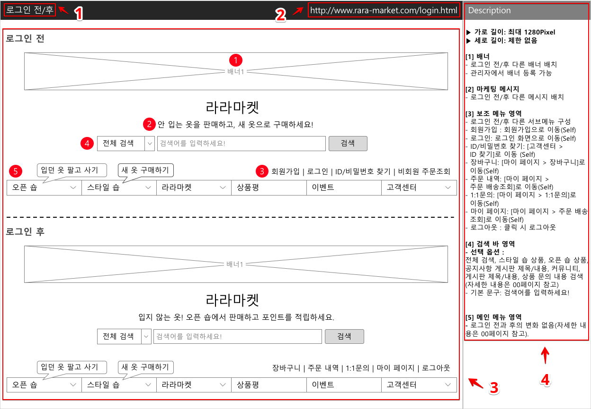
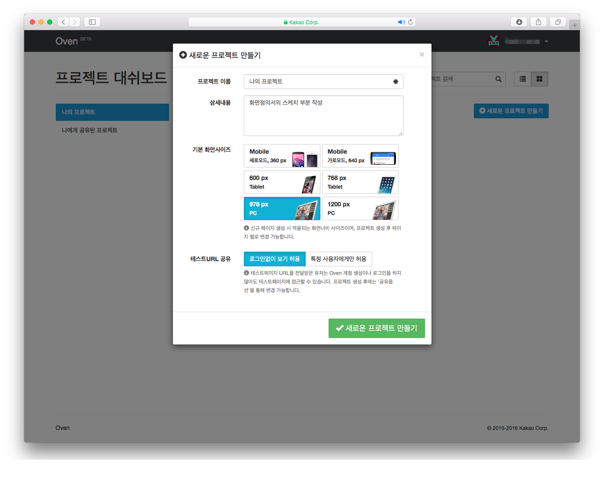
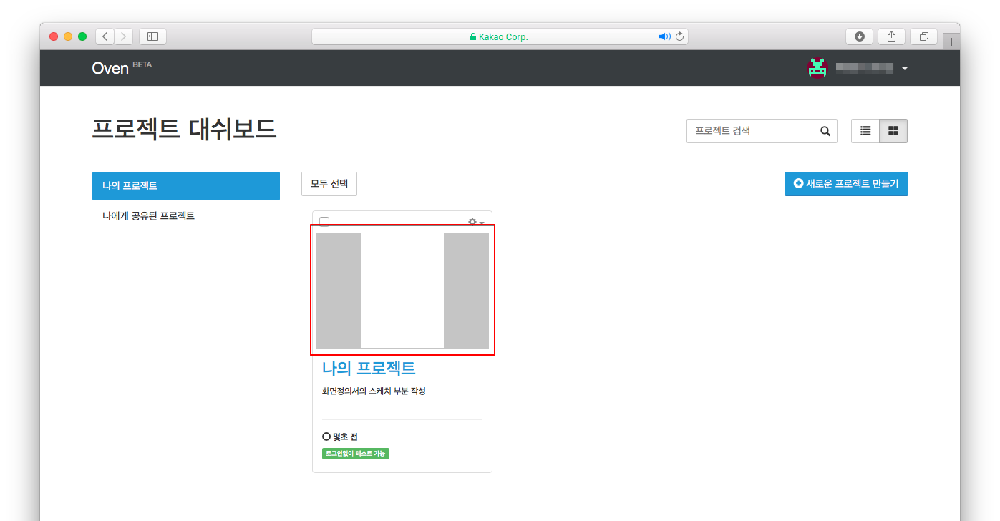

# UI/UX 기획 입문 해설 Chapter 4

**작성자** : 정래진 (jrj8819@naver.com)

**작성일** : 2018.05.14

**수정일** : 2018.05.22

**참조**

- 이정원, *Do it! 웹 사이트 기획 입문*, 이지스 퍼블리싱, 2018

## Chapter 4. 웹 사이트 화면 설계하기

### 4-1. 기능을 화면으로 바꾸기

앞에서 정의한 기능을 화면으로 구성해야 한다. 이를 위해서 기능의 범위, 표현 방식, 기획자의 의도에 따라 화면을 만들 수 있다. 하나의 기능을 세분화하여 여러 화면으로 구성할 수 있고, 반대로 여러 기능을 한 화면안에 적용할 수 있다. 기획자는 사용자의 편의성, 기획 목적에 따라 사용할 화면의 수를 결정해야 한다.

#### 하나의 기능을 하나의 화면으로 설계한 경우

기능을 정확하게 표현할 수 있도록 화면 전체가 하나의 기능만 지원하는 경우이다. 일반적인 기업 소개 웹 사이트에서 '회사 소개', '회사 연혁', '찾아오는 길'처럼 내용이 변하지 않는 정적인 정보를 나타낼 때 많이 사용된다.

#### 하나의 기능을 여러 화면으로 설계할 경우

특정 기능이 원활하게 동작하기 위해서는 기능을 세부적으로 나누어 여러화면으로 표현할 경우가 있다. 게시판 기능을 살펴보면, 작성된 글을 보여주는 화면, 글의 상세 내용을 보여주는 화면, 글을 작성할 수 있는 화면 등 여러 화면으로 나누어져 있다.

#### 여러 기능을 하나의 화면으로 설계할 경우

비슷한 기능이나 이전 단계를 수행해야 실행될 수 있는 기능에 대해서는 여러 기능을 하나의 화면으로 설계하면 사용자의 편의성이 높아질 수 있다. 상품 결제 화면을 보면 주문자 정보 입력, 배송지 입력, 결제 방식 선택, 결제 등 다양한 기능이 한 페이지에 나타나 있는 것을 확인할 수 있다.

#### 메뉴 만들기

기능들을 화면에 배치했다면, 비슷한 내용의 화면을 묶어 메뉴를 작성한다. 메뉴는 고정된 것이 아니라 웹 사이트의 특성에 맞게 정하거나, 화면의 공통점으로 해당 메뉴의 이름을 정하면 된다. 예를 들면 아래 그림에서 '청와대 뉴스룸' 메뉴는 '청와대 온에어', '청와대 브리핑', '해외언론보도', '청와대 이야기', '오늘의 한 장', '청와대 일기' 페이지가 모여 있다. 주의할 점은 메뉴명은 주관적인 단어, 유행어, 줄임말, 은어 등을 활용하지 않는다. 우선 직관적이지 않고 시간, 유행이 지나면 의미가 퇴색하기 때문이다.

- 예시

### 4-2. 연습문제1

#### 문제1

다음과 같이 펜션 웹 페이지가 있다. 비슷한 페이지를 묶어서 메뉴를 구성하는 연습을 해보자. 

| 웹 페이지                                                    |
| ------------------------------------------------------------ |
| 대표인사말, 주변관광지, 예약 안내, 예약 확인, Q&A게시판, 공지사항, 찾아오시는길, 가입 완료, 1호 객실소개, 야외수영장, 지역 소개, 2호 객실소개, 방문후기, 포토 갤러리, 3호 객실소개, 스파, 약관 동의, 가입정보입력, 이벤트, 펜션 전경, 바베큐장, 실시간예약 |

#### 문제2

기능 정의서에서 작성한 기능에 대해 화면으로 설계해 보자. 기능을 화면으로 바꾸는 3가지 경우를 참고하여 화면을 만들어 보고 다음 표와 같이 화면을 기준으로 정리해보자.

| 화면                              | 포함된 기능                                                  |
| --------------------------------- | ------------------------------------------------------------ |
| 회사 소개 화면                    | - 회사를 소개한다.                                           |
| 인사말 화면                       | - CEO의 인사말을 표시한다.                                   |
| 찾아오시는 길 화면                | - 회사의 위치를 지도로 표시한다.                             |
| 커뮤니티 게시판 목록 화면         | - 커뮤니티 게시판의 글 목록을 보여준다.                      |
| 커뮤니티 게시판 글 작성 화면      | - 커뮤니티 게시판의 글을 작성할 수 있다.                     |
| 커뮤니티 게시판 글 내용 보기 화면 | - 커뮤니티 게시판의 글 내용을 볼 수 있다.                    |
| 상품 결제 화면                    | - 총 상품 금액을 볼 수 있다. - 주문자 정보를 입력할 수 있다. - 결제 방법을 선택할 수 있다. |

#### 문제3

문제 2에서 설계한 화면에 대해 비슷한 기능을 하는 화면들을 메뉴를 구성해보자. 다음은 청와대 홈페이지([http://www.president.go.kr](http://www.president.go.kr)) 를 기준으로 작성한 메뉴 예시이다.

| 메뉴이름      | 화면이름                                                     |
| ------------- | ------------------------------------------------------------ |
| 문제인 대통령 | - 공개일정 - 걸어온길 - 대통령의 말과 글 - 김정숙의 말과 글 |
| 청와대 뉴스룸 | - 청와대 온에어 - 청와대 브리핑 - 해외언론보도 - 청와대 이야기 - 오늘의 한 장 - 청와대 일기 |
| 정책자료      | - 정책현안 - 정책브리핑 - 국정과제 - 2018년 정부부처 업무보고 - 숫자로 보는 정책 |
| … …           | - … ... - … ...                                           |

### 4-3. 화면 설계하기

#### 화면 정의서 작성하기

화면 정의서는 웹 사이트의 기능, 정책들을 반영하여 실제 화면에 대해 작성한 문서이다. 화면 정의서 작성하는 것은 다양한 기능과 이용자의 사용행태에 따라 따져봐야 할 경우가 많아 양적으로나 질적으로나 힘든 작업이다. 다만, 화면정의서는 디자이너, 퍼블리셔, 개발자가 웹사이트를 구현할 때 쉽고 간편하게 참고할 수 있으므로 작업에 도움을 준다.

##### 문서 이력

화면 정의서의 내용이 바뀔 때마다 버전을 정해 기록해 두면 몇가지 장점이 있다. 첫째로 수정된 내용을 찾아보기 편하다. 기획을 빈틈없이 진행해도 클라이언트의 요청, 작업 내용의 변경 등이 있다면, 기존의 기획 내용을 수정해야한다. 이 때 수정한 부분에 대해서 명시해놓은 '문서 이력'을 활용하면 작업에 도움이 된다. 둘째로, 피드백을 할 수 있다. 여러 가지 문제로 이전 버전으로 되돌려야 되는 경우에 버전을 몇개 작성하였으며 어느 버전이 가장 좋은 방법임을 되짚어보는 자료가 된다. 문서 이력 작성의 예는 아래 그림과 같다.

1. 순서에 맞게 버전을 표기한다. 보통 0.01부터 시작한다.
2. 문서 수정이 완료된 날짜를 기록한다.
3. 버전별로 수정된 내용을 작성한다. 필요에 따라 관련 쪽수도 작성한다.
4. 작성자의 이름과 직급을 입력한다.

##### 사이트맵

사이트 맵은 웹 사이트에 설계해야 할 메뉴를 정리해 놓은 문서이다. 사이트 맵은 웹 사이트에 속해있는 웹 페이지를 한눈에 파악할 수 있어야 한다.  웹 사이트가 많은 웹 페이지를 담고 있어 다이어그램으로 표현하기 힘들다면 표 형태로 구성하여도 좋다.

##### 본문 내용

1. 화면 이름 : 화면이름은 해당 화면의 이름을 작성하는 부분이다. 화면이 담고 있는 내용 및 기능에 대해 이용자의 관점에서 작성한다. 
2. URL : URL은 화면의 실제 웹 주소는 표시하는 부분이다.  내가 작성한 기획 내용과 퍼블리싱된 내용을 비교하기 편리하고, 수정 내용이 있을 경우 해당 웹 페이지를 쉽게 찾을 수 있다.
3. 스케치 : 글, 그림, 표, 도형 등을 사용해서 웹 사이트의 화면을 그리는 영역이다. 최대한 웹 페이지의 형태와 비슷하게 작성한다. 이때는 색상을 쓰지 않고 검정 계열로 통일한다.
4. 설명 : 스케치한 내용을 설명하는 공간이다. 스케치에서 알기 어려운 부분을 보출 설명하고, 업무와 관련하여 알아야 할 내용을 작성한다.

##### 본문 작성 순서

1. 순서대로 모든 화면을 대략 스케치한다.

   화면을 웹 사이트의 흐름에 집중하여 대략적으로 스케치한다. 도중에 떠오르는 아이디어나 주의 사항을 설명 부분에 메모한다.

2. 모든 화면의 설명을 작성한다.

   대략적인 스케치가 끝나면 설명 부분을 작성해야 한다. 각 화면의 기능, 메뉴, 이용방법, 작업 요청 사항 등을 기입한다.

3. 이용자 행태를 반영하여 스케치와 설명을 구체화한다.

   작성한 스케치와 설명의 오류를 바로잡고, 이용자의 변칙 이용 등 여러가지 이용행태를 반영하여 구체화한다. 

4. 완성~!

##### 스케치 작성 요령

1. 스케치는 검정 계열의 색상만 사용한다.

   일반적으로 스케치는 검정 계열 색상외에 다른 색상을 사용하지 않는다. 다만 강조하는 경우 적색 등 다른 색상을 사용하기도 한다. 기획자가 색상에 대해 요청을 할 경우에는 설명 부분에 색상을 작성하여 전달하는 것이 좋다.

2. 텍스트는 실제 내용과 비슷하게 쓴다.

   상품 제목이나 상품 후기 게시판 등 텍스트가 나타나는 부분을 스케치 할 때는 실제 내용을 적은 것처럼 표시하는 것이 좋다. 물론 'ㅁㄴㅇㄹ', 'asdfasdf'로 스케치해도 텍스트가 나타남을 알 수 있지만 불필요한 오해를 살 수 있으니 조심해야 한다. 실재 개발시 작성될 내용의 길이를 가늠하여 공간을 적절히 분배할 수 있고 작업자가 화면을 이해하는 데 도움이 된다.

3. 시각적 요소를 활용하자

   웹 사이트가 강조하는 상징적인 아이콘이 있다면 적극적으로 활용하자. 긴 설명 대신 아이콘을 활용하면 화면을 간결하게 작성할 수 있고 사용자의 사용성도 높일 수 있다.

   - 참고 사이트 : 안드로이드 머티리얼 디자인 (https://material.io/tools/icons)

4. 데이터가 호출되는 부분은 중괄호{}로 표시하자

   웹 쇼핑몰을 만들 때 상품 수 대로 상품 소개 화면을 만들지 않는다. 대신 화면 구성은 하나만 만들고 데이터를 호출하는 방식으로 화면 구성을 반복하여 사용한다.  이때 데이터 호출이 필요한 부분은 중괄호로 묶어 '{항목명}'으로 표기한다. 

5. 화면이 길면 슬라이드를 나누어 설계하자.

   웹 사이트 화면은 위, 아래로 스크롤 할 수 있다. 긴 화면을 표현하기 어려울 경우는 한 화면을 나누어 표현한다. 이처럼 화면을 나누었을 때는 아래처럼 스케치 화면의 위 또는 아래에 도형을 삽입하여 화면이 서로 연결됨을 나타낸다.

##### 설명 작성 요령

1. 번호 순서대로 제목과 내용을 작성한다.

   번호에 맞는 제목과 내용을 설명 부분에 작성한다. 작업자(디자이너, 퍼블리셔, 개발자)는 스케치 위에 있는 번호와 일치하는 설명 내용을 찾아 읽는다. 이 번호는 스케치와 설명 내용을 연결해 주는 역할만 한다. 숫자 대신 알파벳을 사용해도 좋다.

2. 분할된 화면이면 위치를 표시한다.

   웹 페이지 화면은 세로 화면이 길게 구성되어 있는 경우가 많다. 웹 화면이 길어서 화면을 여러 슬라이드로 나누어 작성했다면, 현재 보고 있는 화면 정의가 어느 순서인지 알 수 있도록 설명 부분 위에 화면의 순서를 표시한다.

3. 기능 설명은 웹에서 동작되는 상황 그대로 설명한다.

   웹 기획자가 디자인 퍼블리싱에 대한 지식이 있다면, 직접 코드의 일부분을 작성하여 표시해도 좋다. 하지만 지식이 없다면, 웹에서 동작하는 상황을 그대로 설명하여 개발자나 퍼블리셔가 어떤 작업을 해야하는지 유추할 수 있도록 설명해야한다. 많이 사용되는 기능이라만 간단한 기능 이름만 표기하기도 한다.

   > [1] 장바구니 클릭시
   >
   > - alert('상품을 장바구니에 담았습니다.')
   > - 이용자가 선택한 옵션, 수량 정보와 함께 장바구니 목록에 해당 상품이 저장
   > - 관리자 계정에서 품절로 설정되면 : 버튼 숨김
   >
   > [2] 하단 배너
   >
   > - 사이즈 : 350 x 220
   > - 링크 : www.naver.com
   > - 제목은 진한 색으로 강조

4. 데이터 호출 정보는 사실적으로 표현한다.

   데이터를 호출하여 표기해야 할 경우에는 어떤 데이터를 얼마나, 어떻게 호출할 것인지 정의하는 것이 중요하다. 예를 들어 게시판 목록에 게시글이 몇 개까지 표시되는지, 상품 리스트 화면에는 상품을 몇 개나 배치해야 하는지 등이다.

   > [1] 상품리스트
   >
   > - 데이터가 없는 경우 : '등록된 상품이 없습니다.'
   > - Default : 최신순으로 페이지당 4*5, 20개 표기 > 리스트에 표기될 상품 데이터 정렬 기준(최소가, 최대가, 인기순 등) 및 페이지의 라인당 상품 수, 라인 수, 총 상품 수
   >
   > [2] 공지사항 게시판
   >
   > - 데이터가 없는 경우 : '게시글이 없습니다.'
   > - Default : 최시순으로 페이지당 10개 표기 > 리스트에 표기될 게시글의 정렬 기준 및 페이지당 게시물 수
   > - 게시글 작성 권한 : 관리자
   > - 글 보기권한 : 관리자, 회원, 비회원

### 4-4. 연습문제2

#### 문제1

다음은 일반적인 회원 가입 화면이다. 스케치를 보고 각 번호에 해당하는 설명을 완성하시오.

#### 문제2

문제1의 그림에서 설명을 추가해야할 스케치 요소는 무엇이며, 해당 부분에 대한 설명을 작성하시오

| 스케치요소 | 설명 |
| :--------: | :--: |
|            |      |

### 4-5. Oven 활용하기

화면 정의서의 스케치 부분을 손쉽게 작성할 수 있는 'Oven'이라는 서비스를 소개한다. 비슷한 서비스로 PowerMockup, Draw.io 등이 있다. 대표적으로 다음과 같은 기능을 제공한다. 공식홈페이지(https://ovenapp.io) 의 내용을 가져왔다.

> **손쉬운 페이지 드로잉**
>
> 생각하는 대로 혹은 보이는 대로 개체를 가져다 놓고, 편집하기만 하면 됩니다. 익숙하게 사용해왔던 그 방법 그대로 말이죠. 그리고 다양한 스타일편집 기능과 효과 적용을 통해 마치 도화지에 그림 그리듯 쉬운 방식으로 실제 웹기반 프로토타이핑을 만들어 낼 수 있습니다.
>
> **100여개의 기본제공 컴포넌트**
>
> Oven은 13개 카테고리 총 100여개의 멋진 UI 컴포넌트를 제공합니다. 그리고 이 컴포넌트들은 원하는 형태로 얼마든지 변형해 사용할 수 있습니다.
>
> **1,200여개의 방대한 벡터아이콘**
>
> 심플하고 명료한 오픈라이센스 아이콘팩들을 제공합니다. 더 놀라운 것은 이 모두가 어떠한 사이즈, 어떠한 컬러로도 변경할 수 있는 벡터 아이콘이라는 점입니다.
>
> **다양하게 선택가능한 스크린**
>
> 모바일과 태블릿, PC스크린 사이즈까지 다양한 사이즈 선택을 지원합니다. 또한 테스트할 모바일 기기의 화면 크기가 제각각이어도 걱정할 필요가 없이 Oven에서는 속편하게 하나로만 작업하시면 됩니다. 어떠한 사이즈의 폰에서도 자동스케일링되어 깨지지 않고 멋지게 보이니까요.
>
> **간편한 이미지업로드와 편집**
>
> 직접 만든 아이콘 이미지나 이미 작업한 시안이 있다구요? 프로젝트 편집화면에 내컴퓨터의 이미지파일을 드래그&드롭 하기만 하면 바로 유저 계정으로 업로드됩니다. 그리고 업로드한 이미지들은 이미지크롭/필터 기능을 이용해 새로운 이미지로 재탄생시킬 수 있습니다.
>
> **템플릿 동기화, 클릭 한번으로 모두를 변화시키는 마법**
>
> 수십장의 페이지를 만들었는데, 상단의 공통로고가 바뀌었다구요? 더이상 일일히 페이지 수정을 하실 필요가 없습니다. '템플릿 동기화' 기능을 통해 클릭 한번으로 프로젝트 전체를 변경할 수 있습니다.
>
> **손쉬운 링크이동 설정**
>
> 화면의 각 요소들이 페이지링크로 연결되는 그 순간이야말로 프로토타입이 생명력을 갖게 되는 순간입니다. 각 요소에 대한 '링크연결 설정' 기능을 통해 외부 URL이나 프로젝트내 페이지를 연결하여 테스트해보세요.
>
> **문장 자동생성 기능**
>
> 대부분의 프로토타입 툴이나 오피스 프로그램들은 텍스트 상자나 위젯을 가져다 놓으면 항상 같은 초기값(예: “텍스트”)으로 페이지에 삽입이 됩니다. 결국 그럴듯한 프로토타입을 만들려면 글자 내용을 직접 타이핑해야 한다는 이야기지요. Oven에서는 박스 사이즈에 따라 영문 또는 한글의 Lorem Ipsum (의미 없는 무작위 문장)을 자동으로 생성해줍니다.
>
> **Font 호환성**
>
> 윈도우에서 작성한 문서와 맥에서 작성한 문서가 서로 달라보이는 현상은 바로 시스템 기본 폰트가 다르기 때문에 발생합니다. Oven은 이 문제를 해결하기 위해 오픈라이센스 폰트인 본고딕체(HanSans)를 한국어 환경에서의 기본 글꼴로 적용하였습니다.
>
> **QR 로 찍고 바로 테스트**
>
> Oven은 '웹 테스트' 모드를 제공합니다. QR 또는 URL을 통해 PC는 물론 스마트디바이스에서 곧바로 작동가능한 웹테스트를 실행할 수 있습니다.
>
> **오브젝트 검색**
>
> 수백개의 아이콘과 수많은 컴포넌트들을 일일히 찾아본다는 건 생각도 할 수 없습니다. 필요한 요소는 컴포넌트 검색창으로 검색해서 사용하세요.
>
> **나만의 컴포넌트**
>
> 열심히 만든 컴포넌트, 다음에 또 쓰일 지 모른다면 '보관함에 보내기'를 통해 보관해 둘 수 있습니다.
>
> **공유 옵션**
>
> 프로젝트별 공유 옵션 목록을 통해 유저별 읽기권한을 설정할 수 있습니다. 또는 링크를 아는 유저는 누구나 로그인없이 접근할 수 있도록 할 수도 있습니다.
>
> **다른 파일로 내보내기**
>
> '페이지 내보내기'를 통해 JPG, PNG 또는 PDF파일로 내려받을 수 있습니다. 메일이나 다른 문서에 첨부하거나 문서출력을 해야 할 경우에 유용합니다.

#### 회원가입

1. 서비스를 활용하려면 Oven 서비스에 가입을 해야한다. Oven 웹 페이지 (https://ovenapp.io)의 '새 계정 만들기' 버튼을 클릭하자.

2. 이메일, 이메일 주소확인, 유저 이름, 비밀번호 등을 입력하고 '새 계정 만들기' 버튼을 선택하여 회원에 가입하자.

3. 회원 가입 후 안내 메시지, 회원가입 시 작성한 이메일에서 이메일 인증을 마치면 Standard 계정으로 무료 업그레이드 할 수 있다.

- Free VS Standard

4. 프로젝트 대쉬보드 화면

#### 새로운 프로젝트 만들기

1. 프로젝트 대쉬보드 화면에서 '새로운 프로젝트 만들기' 버튼을 선택하자.

2. 프로젝트 이름, 상세내용, 기본 화면사이즈, 테스트URL 공유를 작성 및 선택하고 '새로운 프로젝트 만들기' 버튼을 선택하자. 아래 그림에서는 기본 화면사이즈가 PC로 되어 있지만, APP일 경우는 Mobile을 선택하자. 

   *테스트URL 공유 선택란에서 '특정 사용자에게만 허용'에서는 프로젝트의 '공유옵션'에서 선택한 사용자만 프로젝트를 공유할 수 있다. 해당 사용자는 Oven 서비스에 가입되어 있어야 한다.

3. 생성된 프로젝트를 더블 클릭하면 프로젝트 빌더 화면으로 이동한다.

- 프로젝트 빌더 화면

#### 프로젝트 빌더 화면 구성

1. 페이지 목록 : 작업한 페이지를 표시하는 목록, *페이지는 파워포인트의 슬라이드와 같은 개념
2. 편집 캔버스 : 웹 페이지를 수정하기 위한 부분
3. 오브젝트 목록 : 미리 작성되어 있는 요소, 아이콘, 이미지, 저장된 요소를 표시하는 목록이며, 드래그앤드롭으로 편집 캔버스에 배치할 수 있다.
4. 상단 메뉴바 : 페이지, 정렬, 효과, 테이블, 메모, 보기 등 Oven에서 제공하는 기능을 표시한 메뉴
5. 퀵 메뉴 : 선택된 요소 또는 이미지를 다루기 위해 필요한 기능을 빠르게 실행할 수 있는 아이콘이 모여있는 부분

### 4-6. 연습문제3

##### 문제1

아래 그림은 모 포탈사이트의 메인화면을 보고 작성한 화면이다. 오브젝트 목록의 요소들을 이용하여 그림과 같이 배치하자.

##### 문제2

아래 두 서비스 중 하나를 선택하여 웹 사이트를 스케치해보자.

- airbnb

- youtube (Mobile)

