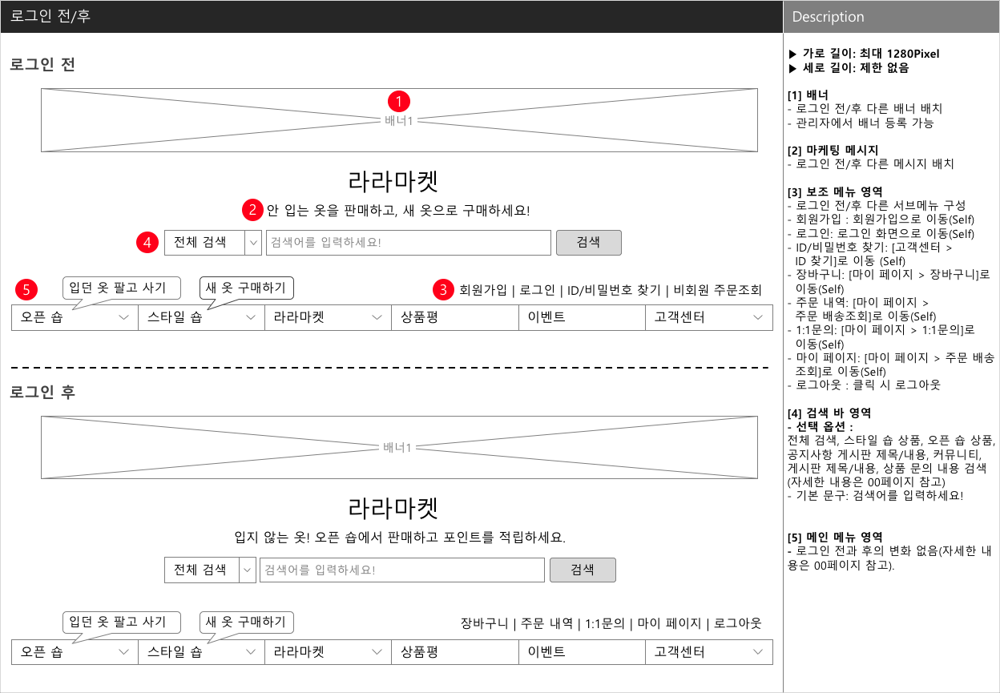

# UI/UX 기획 입문 해설 Chapter 5

**작성자** : 정래진 (jrj8819@naver.com)

**작성일** : 2018.05.22

**참조**

- 이정원, *Do it! 웹 사이트 기획 입문*, 이지스 퍼블리싱, 2018

## Chapter 5. 화면 정의서 작성하기

### 5-1. 헤더와 푸터

#### 메뉴와 로그인 전후 화면(헤더) 설계하기

##### To-do

1. 회원 가입 기능이 있는 웹 사이트의 경우 로그인 전 후 화면을 구분하여 설계한다.

   로그인 전의 화면에서는 웹 쇼핑몰의 특징을 강조하여 회원 가입을 유도하는 것이 좋다. 반면, 로그인 후의 화면에서는 원하는 상품을 쉽게 찾고 제품의 특징을 잘 알아볼 수 있게 설계하자.

2. 헤더에서 가장 중요한 요소는 메뉴이다.

   일반적으로 가장 중요한 메뉴를 왼편에 배치하는 경향이 있다. 대체로 상품 판매를 주된 목적으로 삼는 웹 쇼핑몰에서는 주로 상품 카테고리 메뉴를 왼쪽에 배치한다.

3. 배너는 이동하는 링크 주소를 표시해야 한다.

   배너를 클릭했을 때 이동할 화면의 링크 주소를 설명란에 작성한다. 하지만 웹 쇼핑몰 초기에는 아직 링크 주소가 없을 수 있으므로 이동할 화면의 메뉴 경로(고객센터 > 공지사항)를 표시할 수도 있다.

4. 서브 타이틀로 메시지를 전달하자.

   서브 타이틀을 통해 비회원과 회원에게 필요한 메시지를 각각 따로 기획할 수 있다.

5. 로그인 여부에 따라 보조 메뉴 영역이 달라져야 한다.

   보조 메뉴 영역도 로그인 전후가 반드시 달라져야 하는 메뉴이다. 로그인 전에는 [회원가입]과 [로그인] 메뉴를 반드시 배치해야 하고, 로그인 후에는 이용자가 회원 정보와 주문 정보를 확인할 수 있는 메뉴, 이용자가 자주 이용하는 메뉴를 베치한다.

6. 검색어 입력 부분을 활용하여 메시지를 전달하자.

   검색어를 입력하는 공간에 '검색어를 입력하세요!'라는 기본 문구가 있다. 사용자가 이부분을 클릭하면 기본 메시지는 사라지고 검색창이 활성화된다. 이러한 기능을 '플레이스홀더(PlaceHolder)'라고 한다.

#### 메뉴 설계하기

1. 마우스 커서를 1번, 3번, 5번, 8번 메뉴 위에 올려 놓으면 서브 메뉴가 자동으로 펼쳐지고, 6번과 7번 메뉴는 서브메뉴가 없다.

   서브메뉴가 없는 경우는 해당 화면으로 바로 이동할 수 있도록 설계한다.

2. [오픈 숍]과 [스타일 숍] 같은 상품 카테고리 메뉴는 카테고리별로 상품을 미리 볼수 있도록 설계할 수 있다.

#### 푸터 설계하기

1. 푸터는 이용 빈도가 낮은 내용을 배치한다.

   이용자에게 추가로 알리고 싶은 정보, 웹 쇼핑몰과 관련된 다른 웹 사이트 정보, 이용자의 궁금증을 해소할 수 있는 정보, 웹 쇼핑몰 관련 법 정보 등을 배치한다.

2. 사업자 정보를 표시한다.

   '전자상거래 등에서 소비자 보호에 관한 법률 제10조(사이버몰의 운영)'와 '전자상거래 등에서의 소비자 보호에 관한 법률 시행 규칙 제7조(사이버몰 운영자의 표시 방법)'에 의해 아래와 관련된 사업자 정보를 첫 화면에 모두 표시하고, 이용자 약관을 링크로 연결한다. (관련 법률은 국가법령정보센터 홈페이지(www.law.go.kr)나 관련 앱으로 확인할 수 있다.)

   ​

   - 상호 및 대표자 성명
   - 영업소가 있는 곳의 주소
   - 전화번호, 전자 우편 주소
   - 사업자 등록 번호
   - 사이버몰의 이용 약관

3. '사업자 번호 확인' 링크를 만들자.

   전자상거래 소비자 보호법에 의해 허가 받아 운영하는 사이버 사업장이라는 것을 이용자에게 확인시켜 주기 위해 사업자 등록 번호를 확인하기 위한 링크를 만어야 한다. 

   공정거래위원회 (www.ftc.go.kr) 홈페이지의 [정보 공개 > 사업자 등록 현황 > 통신 판매 사업자] 메뉴 화면으로 연결한다.

4. 저작권을 표기한다.

   저작권은 저작물을 창작한 순간에 자동적으로 발생하기 때문에 저작권표시가 없어도 저작권법에 보호 받을 수 있다.

   

   ​