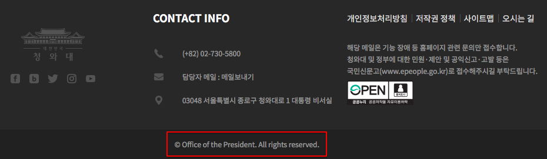
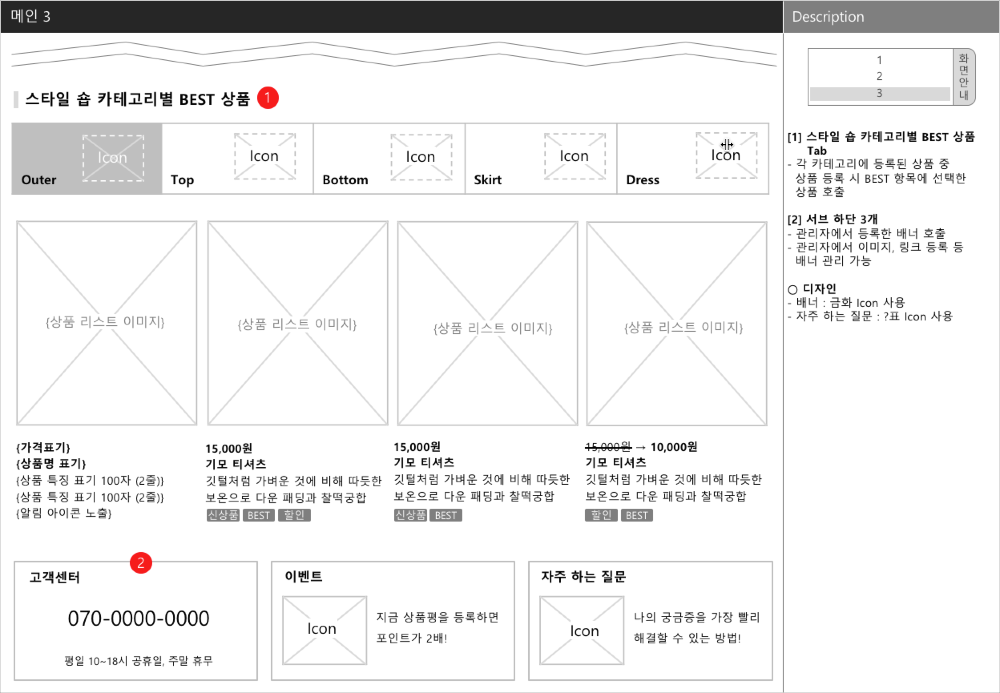

# UI/UX 기획 입문 해설 Chapter 5, 6

**작성자** : 정래진 (jrj8819@naver.com)

**작성일** : 2018.05.22

**참조**

- 이정원, *Do it! 웹 사이트 기획 입문*, 이지스 퍼블리싱, 2018

## Chapter 5. 화면 정의서 작성하기

### 5-1. 헤더와 푸터

#### 메뉴와 로그인 전후 화면(헤더) 설계하기

##### To-do

1. 회원 가입 기능이 있는 웹 사이트의 경우 로그인 전 후 화면을 구분하여 설계한다.

   로그인 전의 화면에서는 웹 쇼핑몰의 특징을 강조하여 회원 가입을 유도하는 것이 좋다. 반면, 로그인 후의 화면에서는 원하는 상품을 쉽게 찾고 제품의 특징을 잘 알아볼 수 있게 설계하자.

2. 헤더에서 가장 중요한 요소는 메뉴이다.

   일반적으로 가장 중요한 메뉴를 왼편에 배치하는 경향이 있다. 대체로 상품 판매를 주된 목적으로 삼는 웹 쇼핑몰에서는 주로 상품 카테고리 메뉴를 왼쪽에 배치한다.

3. 배너는 이동하는 링크 주소를 표시해야 한다.

   배너를 클릭했을 때 이동할 화면의 링크 주소를 설명란에 작성한다. 하지만 웹 쇼핑몰 초기에는 아직 링크 주소가 없을 수 있으므로 이동할 화면의 메뉴 경로(고객센터 > 공지사항)를 표시할 수도 있다.

4. 서브 타이틀로 메시지를 전달하자.

   서브 타이틀을 통해 비회원과 회원에게 필요한 메시지를 각각 따로 기획할 수 있다.

5. 로그인 여부에 따라 보조 메뉴 영역이 달라져야 한다.

   보조 메뉴 영역도 로그인 전후가 반드시 달라져야 하는 메뉴이다. 로그인 전에는 [회원가입]과 [로그인] 메뉴를 반드시 배치해야 하고, 로그인 후에는 이용자가 회원 정보와 주문 정보를 확인할 수 있는 메뉴, 이용자가 자주 이용하는 메뉴를 베치한다.

6. 검색어 입력 부분을 활용하여 메시지를 전달하자.

   검색어를 입력하는 공간에 '검색어를 입력하세요!'라는 기본 문구가 있다. 사용자가 이부분을 클릭하면 기본 메시지는 사라지고 검색창이 활성화된다. 이러한 기능을 '플레이스홀더(PlaceHolder)'라고 한다.

#### 메뉴 설계하기

1. 마우스 커서를 1번, 3번, 5번, 8번 메뉴 위에 올려 놓으면 서브 메뉴가 자동으로 펼쳐지고, 6번과 7번 메뉴는 서브메뉴가 없다.

   서브메뉴가 없는 경우는 해당 화면으로 바로 이동할 수 있도록 설계한다.

2. [오픈 숍]과 [스타일 숍] 같은 상품 카테고리 메뉴는 카테고리별로 상품을 미리 볼수 있도록 설계할 수 있다.

#### 푸터 설계하기

1. 푸터는 이용 빈도가 낮은 내용을 배치한다.

   이용자에게 추가로 알리고 싶은 정보, 웹 쇼핑몰과 관련된 다른 웹 사이트 정보, 이용자의 궁금증을 해소할 수 있는 정보, 웹 쇼핑몰 관련 법 정보 등을 배치한다.

2. 사업자 정보를 표시한다.

   '전자상거래 등에서 소비자 보호에 관한 법률 제10조(사이버몰의 운영)'와 '전자상거래 등에서의 소비자 보호에 관한 법률 시행 규칙 제7조(사이버몰 운영자의 표시 방법)'에 의해 아래와 관련된 사업자 정보를 첫 화면에 모두 표시하고, 이용자 약관을 링크로 연결한다. (관련 법률은 국가법령정보센터 홈페이지(www.law.go.kr)나 관련 앱으로 확인할 수 있다.)

   - 상호 및 대표자 성명
   - 영업소가 있는 곳의 주소
   - 전화번호, 전자 우편 주소
   - 사업자 등록 번호
   - 사이버몰의 이용 약관

3. '사업자 번호 확인' 링크를 만들자.

   전자상거래 소비자 보호법에 의해 허가 받아 운영하는 사이버 사업장이라는 것을 이용자에게 확인시켜 주기 위해 사업자 등록 번호를 확인하기 위한 링크를 만어야 한다. 

   공정거래위원회 (www.ftc.go.kr) 홈페이지의 [정보 공개 > 사업자 등록 현황 > 통신 판매 사업자] 메뉴 화면으로 연결한다.

4. 저작권을 표기한다.

   저작권은 저작물을 창작한 순간에 자동적으로 발생하기 때문에 저작권 표시가 없어도 저작권 법에 보호 받을 수 있다.

### 5-2. 메인 화면

1. 메인 배너를 활용하자.

   메뉴 아래의 메인 배너는 이용자이 시선이 가장 집중되는 부분이다. 이용자에게 알려야 하는 사항, 주요상품, 이벤트 등을 노출하는 것이 좋다.

2. 가능한 긴 글은 피한다.

   쇼핑몰의 경우 메인 화면의 70% 이상은 배너와 상품이미지가 차지하기 때문에 메인 화면은 보는 화면에 가깝다. 따라서 메인 화면을 설계할 때 긴 글은 가급적 피해야 한다.

3. 사이트가 활성화 되어 있음을 보여주자.

   업데이트가 자주 일어나는 공지사항, 커뮤니티, 상품평 게시판 등을 표시하여 사이트가 여러 사람들에게 활용되고 있음을 강조하자. 다른 방법으로는 상담되는 콜 수, 판매 금액, 가입자 수를 실시간으로 체크하여 표시하기도 한다.

#### 신상품 및 추천 상품 설계하기

1. 왼쪽 위에서 오른쪽 아래로 구성하자.

   사람은 무언가를 응시할 때 시선이 왼쪽 위에서 오른쪽 아래로 자연스럽게 이동한다고 한다(구텐베르그 법칙). 메인 화면을 설계할 때 사용자의 시선에 따라 중요한 내용을 대각선 방향 순으로 배치하는 것이 좋다. 앞에서의 메인 1번 화면에서 이용자의 시선이 마지막으로 도달하는 오른쪽 아래에 구매에 영향력이큰 상품평 게시판을 배치하였다.

2. 황금분할을 적용하여 이미지 연출하기

   가로 3등분선, 세로 3등분 선이 교차된 지점 내에 상품의 주요 부분을 위치시키면, 전체 상품 목록을 안정적인 구도로 연출할 수 있다. 여백도 균일하여 이용자가 대상에 집중하기 좋다.

#### 베스트 상품 화면 설계하기

1. 텝 메뉴를 활용하자

   상품 카테고리를 텝 메뉴로 만들고 탭을 누르면 해당 카테고리 상품만 보이도록 만들자. 이런 방식은 한정된 공간에서 더 많은 상품을 노출할 수 있다. 추가적으로 일정 시간이 지나면 다른 카테고리가 나타나도록 하면 더 많은 상품을 보여줄 수 있다.

2. 이용자의 편의성을 높이는 기능을 배치하자.

   화면 아래에 고객센터, 이벤트, 자주 하는 질문 배너 등 이용자의 편의를 높이는 기능들을 찾기 쉽게 배치하면, 웹 사이트의 신뢰도를 높이는 데 도움이 된다.

   

#### 연습문제1

포트폴리오를 주제로 헤더, 푸터를 포함한 화면을 화면 정의서로 작성하시오. (최소한 화면 2개 이상 작성할 것)

 

 

## Chapter 6. 테스트하기

#### 6-1. 테스트의 종류

##### 기능 테스트

결과물의 기능이 의도한 대로 작동하는지 확인하는 테스트로, 기능 오류를 막기위해 필수적으로 진행한다.

##### 사용성 테스트

사이트에 불편한 점은 없는지 더 편리하게 이용할 수 있는 방법은 없는지 찾아보는 테스트이다.

| '회원 가입' 기능 테스트 예시                                 | '상품 주문' 사용성 테스트 예시                               |
| ------------------------------------------------------------ | ------------------------------------------------------------ |
| - [회원 가입] 버튼을 클릭 - 아이디 작성 후 중복 확인을 진행 - 전화번호에 숫자 이외의 단어를 입력 - 필수 작성 항목인 이메일 주소를 작성하지 않고 [회원 가입] 버튼을 클릭 | - 상품 주문 시 주소 입력이 어려운가? - 카드 번호를 마이페이지에 입력할 때 불편한 점은 없었나요? - 상품 주문 간소화 방식은 편리한가? - 주문 완료 후 완료된 주문서를 모바일로 보내는 시스템이 유용한가? |

##### 알파 테스트

웹 사이트를 외부에 공개하기 전 개발자나 소수의 내부 테스터를 모집하여 진행하는 테스트이다.

##### 베타 테스트

서비스를 정식 오픈하기 전에 일정 기간 동안 임시로 열어 두고 이용자의 이용 행태를 수집하는 테스트이다. 참여하는 테스터를 제한하는 여부에 따라 제한하면 '클로즈 베타 테스트', 모든 사람이 참여할 수 있으면 '오픈 베타 테스트'로 구분한다.

#### 6-2. 체크리스트 작성하기

체크리스트는 기획자가 진행해야 할 테스트 학목과 순서를 정리한 문서이다. 다양한 환경(OS, 웹브라우져 등)에 대해 체크리스트를 작성하며, 테스트 항목이 누락되지 않도록 사소한 링크라도 빠짐없이 정리해야 한다.

1. 프로세스, Depth : 테스트를 진행할 메뉴의 경로를 입력한다.
2. 확인사항 : 해당 메뉴에서 테스트할 내용을 작성한다.
3. 정상결과 : 결과가 정상인지 아닌지 판단할 수 있는 기준이 된다.
4. Pass/Fail : 테스트의 결과를 작성한다.
5. 요류내용 : 오류가 발생한 경우에 발생된 현상을 메모하고, 화면을 캡쳐하여 첨부한다.

##### 연습문제2

연습문제 1번에서 작성한 화면에 대해 체크리스트를 작성해보자. (단, 실제로 테스트를 수행하지는 말고 '확인사항'과 '정상결과'를 빠짐없이 작성하도록 하자.) 